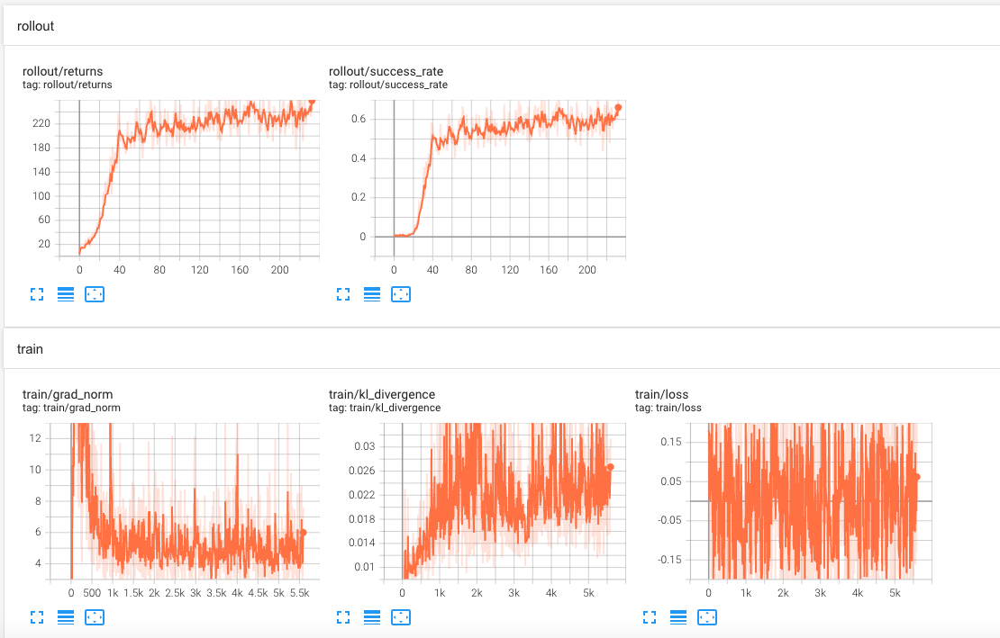

## 一. 简介

LLM学习资源库。使用pytorch和部分Tensorflow2实现，可以 **<u>*本地运行和调试*</u>** 的大模型LLM相关的应用

#### **核心功能**： PPO、GRPO、Deepseek-V3、MLA、Mixtral-8x7B、MOE、Qwen-TensorRT等

再次强调：强调本地调试、代码跳转、快速掌握LLM！basic_llm\*和basic_run\*分别是调试和运行模式

配套课程[《AIGC大模型理论与工业落地实战》](https://edu.csdn.net/course/detail/39082)，[relation](https://github.com/zysNLP/base_course/tree/main)

### 最新更新：
- 20250516：🐯feat:(learnings/tiny-grpo/*):添加GRPO使用Qwen2.5-0.5B和gsm8k_chinese数据集训练和部署完整流程
- 20250516：🐯feat:(learnings/qwen25-vl_sft)添加Qwen2.5-VL-Instruct模型训练、推理、部署服务和请求服务
- 20250514：🐯feat:(learnings/unsloth_models)添加《基于unsloth训练与部署实践DeepSeek-R1 法律推理模型》包括训练、推理、部署服务和请求服务）
- 20250225：🐯feat:(learnings/DeepSeek-V3)添加deepseek-V3官方推理代码（可使用learnings/DeepSeek-V3-codes/inference/model.py脚本在本地GPU(大于40G显存)直接调试！）
- 20250224：🐯feat(quickllm/base_rope.py):新增ROPE简易调试代码
- 20250220：🐯feat(learnings/MLA/*):新增deepseek-MLA注意力机制调试代码
- 20250220：🐯feat(learnings/tiny_grpo/*):新增deepseek-grpo调试代码
- 20231225：🐯feat(basic_llm_moe_transformers.py):新增transformers包的Mixtral-8x7B/MOE源代码调试

## 二、GRPO相关工作

代码：**learnings/tiny-grpo/***

奖励和loss曲线：



### 2.1 核心训练流程

#### 2.1.1 Rollout阶段
```python
def rollout(model, tokenizer, task, oracle_answer, num_rollouts=12):
    # 1. 构建提示词
    chat_prompt = tokenizer.apply_chat_template(chat_messages, ...)
    
    # 2. 生成多个候选答案
    sequence_ids = model.generate(
        input_ids=model_inputs["input_ids"],
        generation_config=generation_config
    )
    
    # 3. 计算相对奖励
    for i, completion in enumerate(completions):
        answer_match = re.search(r"<answer>(.*?)</answer>", completion)
        if answer_match:
            answer = answer_match.group(1)
            if answer == oracle_answer:
                reward = 1.0      # 完全正确
            elif oracle_answer in answer:
                reward = 0.5      # 部分正确
            else:
                reward = 0.01     # 错误
```

#### 2.1.2 优势计算
```python
# 对组内奖励进行标准化
advantages = group_advantages(returns)
# advantages = (returns - returns.mean()) / (returns.std() + eps)
```

#### 2.1.3 损失计算
```python
class GRPOLoss(nn.Module):
    def forward(self, log_probs, experience):
        # PPO裁剪损失
        ratio = (log_probs - old_log_probs).exp()
        surr1 = ratio * advantages
        surr2 = ratio.clamp(1 - clip_eps, 1 + clip_eps) * advantages
        ppo_loss = -torch.min(surr1, surr2)
        
        # KL散度约束
        kl = approx_kl_divergence(log_probs, log_probs_ref, action_mask)
        
        # 总损失
        total_loss = ppo_loss + kl_weight * kl
        return total_loss, kl.mean()
```

## 三. 预训练权重
- 若无说明则使用[huggingface官网](https://huggingface.co/models)中对应模型的`pytorch_model.bin`和对应config.json


## 四.鸣谢

- 感谢Tongjilibo的[bert4torch](https://github.com/Tongjilibo/bert4torch)，本实现重点参考了这个项目，进行了优化和更新；项目会持续跟进bert4torch的最新实现

- 感谢苏神实现的[bert4keras](https://github.com/bojone/bert4keras)，有些地方参考了bert4keras的源码，在此衷心感谢大佬的无私奉献；大佬的科学空间

  ```bibtex
  @misc{bert4torch,
    title={bert4torch},
    author={Bo Li},
    year={2022},
    howpublished={\url{https://github.com/Tongjilibo/bert4torch}},
  }
  ```

## 五. 引用

```bibtex
@misc{quickllm,
  title={quickllm},
  author={NLP小讲堂},
  year={2022},
  howpublished={\url{https://github.com/zysNLP/quickllm}},
}
```


## 六. 其他

关注公众号《NLP小讲堂》，更多高效内容及时订阅，最新文章和[视频](https://edu.csdn.net/course/detail/39082)同步，[B站关注](https://www.bilibili.com/video/BV1hG411e7Ng/?spm_id_from=333.999.0.0&vd_source=9a2f107418c10b543b13cbd8e1f9e98d)：

《Mixtral-8x7B-Instruct-v0.1的finetune微调实战》：参考借鉴[Aurora](https://github.com/WangRongsheng/Aurora)，[Firefly](https://github.com/yangjianxin1/Firefly)

[《浅谈MOE的代码原理（一），是否足够对标self-attention？》](https://mp.weixin.qq.com/s/mbXePBZXIiN3aa8sszPzHQ)参考借鉴：[Mistral Transformers](https://github.com/mistralai/mistral-src)，[Mixture of Expert](https://github.com/lucidrains/mixture-of-experts.git)

《Triton复杂又简单：把部署切成厚厚的薄片。。》参考借鉴：[NGC Triton镜像](https://catalog.ngc.nvidia.com/orgs/nvidia/containers/tritonserver)，[Triton Inference Server GitHub官网](https://github.com/triton-inference-server/server)

《TensorRT-LLM：大模型推理加速必备》参考借鉴：[Qwen-TensorRT原理](https://developer.nvidia.com/zh-cn/blog/qwen-model-support-nvidia-tensorrt-llm)，[Qwen-TensorRT代码](https://github.com/Tlntin/Qwen-TensorRT-LLM/tree/main?tab=readme-ov-file)

《LORA论文解读：大模型的低秩适应》参考借鉴：[LORA论文](https://arxiv.org/pdf/2106.09685.pdf)，[LORA论文解读](https://zhuanlan.zhihu.com/p/624576869)
