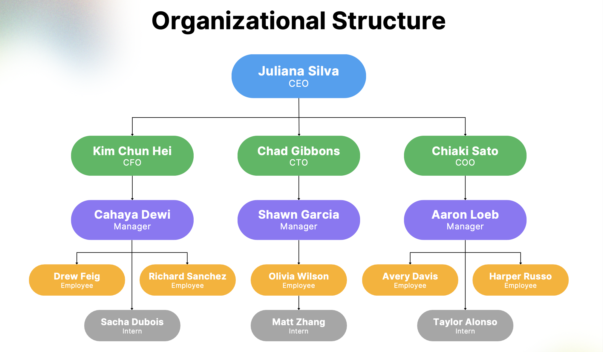
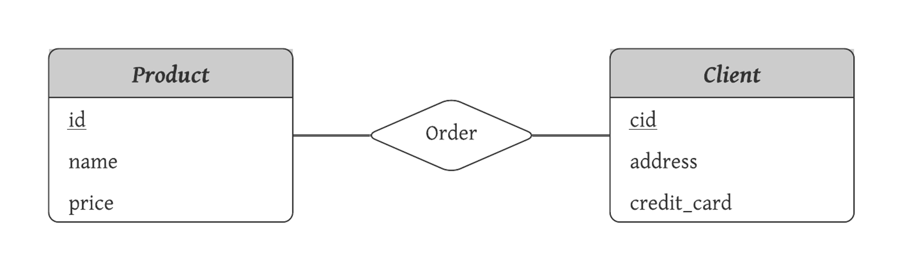

# Lesson 5: Reasoning with images

<div style="background-color:#fff6ff; padding:13px; border-width:3px; border-color:#efe6ef; border-style:solid; border-radius:6px">
<p> 💻 &nbsp; <b>Access <code>requirements.txt</code> and <code>helper.py</code> files:</b> 1) click on the <em>"File"</em> option on the top menu of the notebook and then 2) click on <em>"Open"</em>.

<p> ⬇ &nbsp; <b>Download Notebooks:</b> 1) click on the <em>"File"</em> option on the top menu of the notebook and then 2) click on <em>"Download as"</em> and select <em>"Notebook (.ipynb)"</em>.</p>

<p> 📒 &nbsp; For more help, please see the <em>"Appendix – Tips, Help, and Download"</em> Lesson.</p>

</div>

<p style="background-color:#f7fff8; padding:15px; border-width:3px; border-color:#e0f0e0; border-style:solid; border-radius:6px"> 🚨
&nbsp; <b>Different Run Results:</b> The output generated by AI models can vary with each execution due to their dynamic, probabilistic nature. Don't be surprised if your results differ from those shown in the video.</p>

<p style="background-color:#f7fff8; padding:15px; border-width:3px; border-color:#e0f0e0; border-style:solid; border-radius:6px"> 🚨
&nbsp; <b>Slight Changes:</b> To include some very recent changes, the code here varies slightly from that in the video</p>


```python
# Warning control
import warnings
warnings.filterwarnings('ignore')
```


```python
import json
from openai import OpenAI
from IPython.display import display, Markdown, Image
from helper import get_openai_api_key
openai_api_key = get_openai_api_key()

#from utils import o1_vision

GPT_MODEL = 'gpt-4o-mini'
O1_MODEL = 'o1'

client = OpenAI()
```

## Process images

We need to process any images into base64 encoding so we can submit them to `o1` with Vision.


```python
image_filepath = 'data/org_chart_sample.png'

display(Image(image_filepath))
```


    

    


```python
import base64
def encode_image(image_path):
    with open(image_path, "rb") as image_file:
        return base64.b64encode(image_file.read()).decode("utf-8")

#print(response.choices[0].message.content)

def o1_vision(file_path,prompt,model,json_mode=False):

    base64_image = encode_image(file_path)

    if json_mode:

        response = client.chat.completions.create(
            model=model,
            messages=[
                {"role": "user", "content": [
                    {"type": "text", "text": prompt},
                    {"type": "image_url", "image_url": {
                        "url": f"data:image/png;base64,{base64_image}"}
                    }
                ]}
            ],
            response_format={ "type": "json_object" }
        )

    else:
        
        response = client.chat.completions.create(
            model=model,
            messages=[
                {"role": "user", "content": [
                    {"type": "text", "text": prompt},
                    {"type": "image_url", "image_url": {
                        "url": f"data:image/png;base64,{base64_image}"}
                    }
                ]}
            ],
        )

    return response

```


```python
response = o1_vision(file_path=image_filepath
                     ,prompt='What is this?'
                     ,model=O1_MODEL)
```


```python
display(Markdown(response.choices[0].message.content))
```


It’s an organizational (org) chart showing a company’s hierarchy. At the top is the CEO, followed by the CFO, CTO, and COO, then each has several managers reporting directly beneath them. Under each manager are employees, and then interns at the bottom tier of the chart. The chart visually represents who reports to whom within the organization.


## Image understanding

Where `o1` with Vision shines is in **reasoning** with images - by testing and learning it can identify hallucinations and generally do better than 4o with similar nuanced problems.


```python
structured_prompt = ("<instructions>You are a consulting assistant who processes org data. "
                     "Extract the org hierarchy from the image you're provided in a structured format. "
                     "The structure should be returned in JSON containing:\n"
                     "- arbitrary ID of the person that you can generate\n"
                     "- name of the person\n"
                     "- role of the person\n"
                     "- an array of IDs they report to\n"
                     "- an array of IDs that report to them"
                     "</instructions>")
print(structured_prompt)
```

    <instructions>You are a consulting assistant who processes org data. Extract the org hierarchy from the image you're provided in a structured format. The structure should be returned in JSON containing:
    - arbitrary ID of the person that you can generate
    - name of the person
    - role of the person
    - an array of IDs they report to
    - an array of IDs that report to them</instructions>


```python
o1_response = o1_vision(file_path=image_filepath
                        ,model='o1'
                        ,prompt=structured_prompt
                        ,json_mode=True)
print(o1_response.choices[0].message.content)
```

    {
      "organization": [
        {
          "id": "id1",
          "name": "Juliana Silva",
          "role": "CEO",
          "reportsTo": [],
          "manages": ["id2","id3","id4"]
        },
        {
          "id": "id2",
          "name": "Kim Chun Hei",
          "role": "CFO",
          "reportsTo": ["id1"],
          "manages": ["id5"]
        },
        {
          "id": "id3",
          "name": "Chad Gibbons",
          "role": "CTO",
          "reportsTo": ["id1"],
          "manages": ["id6"]
        },
        {
          "id": "id4",
          "name": "Chiaki Sato",
          "role": "COO",
          "reportsTo": ["id1"],
          "manages": ["id7"]
        },
        {
          "id": "id5",
          "name": "Cahaya Dewi",
          "role": "Manager",
          "reportsTo": ["id2"],
          "manages": ["id8","id9","id13"]
        },
        {
          "id": "id6",
          "name": "Shawn Garcia",
          "role": "Manager",
          "reportsTo": ["id3"],
          "manages": ["id10","id14"]
        },
        {
          "id": "id7",
          "name": "Aaron Loeb",
          "role": "Manager",
          "reportsTo": ["id4"],
          "manages": ["id11","id12","id15"]
        },
        {
          "id": "id8",
          "name": "Drew Feig",
          "role": "Employee",
          "reportsTo": ["id5"],
          "manages": []
        },
        {
          "id": "id9",
          "name": "Richard Sanchez",
          "role": "Employee",
          "reportsTo": ["id5"],
          "manages": []
        },
        {
          "id": "id10",
          "name": "Olivia Wilson",
          "role": "Employee",
          "reportsTo": ["id6"],
          "manages": []
        },
        {
          "id": "id11",
          "name": "Avery Davis",
          "role": "Employee",
          "reportsTo": ["id7"],
          "manages": []
        },
        {
          "id": "id12",
          "name": "Harper Russo",
          "role": "Employee",
          "reportsTo": ["id7"],
          "manages": []
        },
        {
          "id": "id13",
          "name": "Sacha Dubois",
          "role": "Intern",
          "reportsTo": ["id5"],
          "manages": []
        },
        {
          "id": "id14",
          "name": "Matt Zhang",
          "role": "Intern",
          "reportsTo": ["id6"],
          "manages": []
        },
        {
          "id": "id15",
          "name": "Taylor Alonso",
          "role": "Intern",
          "reportsTo": ["id7"],
          "manages": []
        }
      ]
    }


### Analysis

Now that we've extracted the information, we can use it for Q&A.


```python
cleaned_json = o1_response.choices[0].message.content.replace('```json','').replace('```','')
```


```python
org_data = json.loads(o1_response.choices[0].message.content)
org_data
```


    {'organization': [{'id': 'id1',
       'name': 'Juliana Silva',
       'role': 'CEO',
       'reportsTo': [],
       'manages': ['id2', 'id3', 'id4']},
      {'id': 'id2',
       'name': 'Kim Chun Hei',
       'role': 'CFO',
       'reportsTo': ['id1'],
       'manages': ['id5']},
      {'id': 'id3',
       'name': 'Chad Gibbons',
       'role': 'CTO',
       'reportsTo': ['id1'],
       'manages': ['id6']},
      {'id': 'id4',
       'name': 'Chiaki Sato',
       'role': 'COO',
       'reportsTo': ['id1'],
       'manages': ['id7']},
      {'id': 'id5',
       'name': 'Cahaya Dewi',
       'role': 'Manager',
       'reportsTo': ['id2'],
       'manages': ['id8', 'id9', 'id13']},
      {'id': 'id6',
       'name': 'Shawn Garcia',
       'role': 'Manager',
       'reportsTo': ['id3'],
       'manages': ['id10', 'id14']},
      {'id': 'id7',
       'name': 'Aaron Loeb',
       'role': 'Manager',
       'reportsTo': ['id4'],
       'manages': ['id11', 'id12', 'id15']},
      {'id': 'id8',
       'name': 'Drew Feig',
       'role': 'Employee',
       'reportsTo': ['id5'],
       'manages': []},
      {'id': 'id9',
       'name': 'Richard Sanchez',
       'role': 'Employee',
       'reportsTo': ['id5'],
       'manages': []},
      {'id': 'id10',
       'name': 'Olivia Wilson',
       'role': 'Employee',
       'reportsTo': ['id6'],
       'manages': []},
      {'id': 'id11',
       'name': 'Avery Davis',
       'role': 'Employee',
       'reportsTo': ['id7'],
       'manages': []},
      {'id': 'id12',
       'name': 'Harper Russo',
       'role': 'Employee',
       'reportsTo': ['id7'],
       'manages': []},
      {'id': 'id13',
       'name': 'Sacha Dubois',
       'role': 'Intern',
       'reportsTo': ['id5'],
       'manages': []},
      {'id': 'id14',
       'name': 'Matt Zhang',
       'role': 'Intern',
       'reportsTo': ['id6'],
       'manages': []},
      {'id': 'id15',
       'name': 'Taylor Alonso',
       'role': 'Intern',
       'reportsTo': ['id7'],
       'manages': []}]}


```python
analysis_prompt = ("<instructions>You are an org chart expert assistant. Your role is to"
                   "answer any org chart questions with your org data.</instructions>\n"
                   f"<org_data>{org_data}</org_data>\n")
```


```python
from helper import get_openai_api_key

openai_api_key = get_openai_api_key()
client = OpenAI(api_key=openai_api_key)
```


```python
messages = [{
    "role": "user",
    "content": analysis_prompt + "<question>Who has the highest ranking reports, and which manager has the most reports?</question>"
}]

response = client.chat.completions.create(model=O1_MODEL,
                                          messages=messages)
```


```python
display(Markdown(response.choices[0].message.content))
```


Answer:

• The person with the highest‐ranking direct reports is Juliana Silva (CEO), as her direct reports are the CFO, CTO, and COO.  
• In terms of who manages the most people (counting direct reports), there is a three‐way tie:  
  – Juliana Silva (CEO) has three direct reports: the CFO, CTO, and COO.  
  – Cahaya Dewi (Manager under CFO) has three direct reports: Drew Feig, Richard Sanchez, and Sacha Dubois.  
  – Aaron Loeb (Manager under COO) has three direct reports: Avery Davis, Harper Russo, and Taylor Alonso.  


## ER Diagram


```python
image_filepath = 'data/erd-relation-order.png'

display(Image(image_filepath))
```


    

    


```python

```
