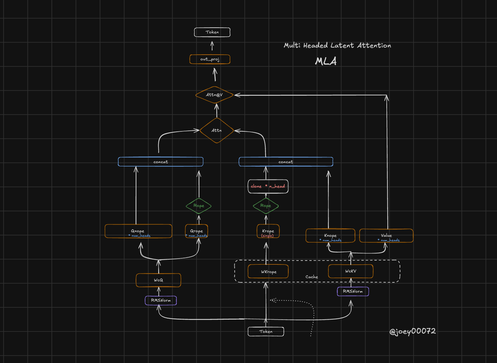

# Multi-Head Latent Attention (MLA)




## Quick Start
install ohara
```bash
pip install ohara
```

To train MLA:
```bash
python train_mla.py --attn_type=mla
```

For baseline, use MHA:
```bash
python train_mla.py --attn_type=mha 
```

---

If you cant to calculate the number of parameters, and check what % kv cache you'll save visite this link:
https://joey00072.github.io/Multi-Head-Latent-Attention-MLA-/


## TODO
- [ ] write blog post
- [ ] add jax version
- [ ] Add GQA and MOQ in calculation (index.html)
- [ ] Distill llama to MLA version Maybe