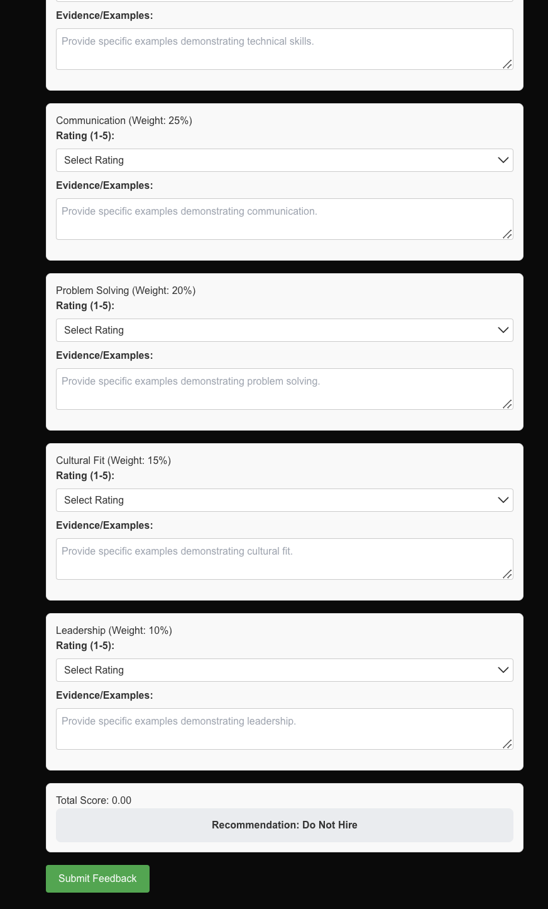

# Lesson 4: Coding with o1

<div style="background-color:#fff6ff; padding:13px; border-width:3px; border-color:#efe6ef; border-style:solid; border-radius:6px">
<p> 💻 &nbsp; <b>Access <code>requirements.txt</code> and <code>helper.py</code> files:</b> 1) click on the <em>"File"</em> option on the top menu of the notebook and then 2) click on <em>"Open"</em>.

<p> ⬇ &nbsp; <b>Download Notebooks:</b> 1) click on the <em>"File"</em> option on the top menu of the notebook and then 2) click on <em>"Download as"</em> and select <em>"Notebook (.ipynb)"</em>.</p>

<p> 📒 &nbsp; For more help, please see the <em>"Appendix – Tips, Help, and Download"</em> Lesson.</p>

</div>

<p style="background-color:#f7fff8; padding:15px; border-width:3px; border-color:#e0f0e0; border-style:solid; border-radius:6px"> 🚨
&nbsp; <b>Different Run Results:</b> The output generated by AI models can vary with each execution due to their dynamic, probabilistic nature. Don't be surprised if your results differ from those shown in the video.</p>


```python
# Warning control
import warnings
warnings.filterwarnings('ignore')

# Import OpenAI key
from helper import get_openai_api_key
openai_api_key = get_openai_api_key()
```


```python
from IPython.display import display, Image, Markdown
from openai import OpenAI

client = OpenAI(api_key=openai_api_key)
GPT_MODEL = 'gpt-4o-mini'
O1_MODEL = 'o1-mini'
```

## Create


```python
def get_chat_completion(model, prompt):
    """
    Calls the OpenAI API to get a chat completion.

    :param model: The model to use for the completion.
    :param prompt: The prompt to send to the model.
    :return: The completion response from the model.
    """
    response = client.chat.completions.create(
        model=model,
        messages=[{"role": "user", "content": prompt}],
    )
    return response.choices[0].message.content
```


```python
react_demo_prompt = """Create an elegant, delightful React component for an Interview Feedback Form where:

1. The interviewer rates candidates across multiple dimensions using rubrics
2. Each rating must include specific evidence/examples
3. The final recommendation should auto-calculate based on a weighted scoring system
4. The UI should guide interviewers to give specific, behavioral feedback

The goal is to enforce structured, objective feedback gathering. A smart model should:
- Create a thoughtful rubric structure
- Add helpful prompts/placeholders
- Build in intelligent validation

Make sure to
 - Call the element FeedbackForm
 - Start the code with "use client"

Respond with the code only! Nothing else!"""
```

```python
react_demo_prompt = """Create an elegant, delightful React component for an Interview Feedback Form where: 
1. 面试官使用评分标准在多个维度上对候选人进行评分
2. 每个评分必须包含具体的证据/示例
3. 最终推荐应基于加权评分系统自动计算
4. 用户界面应引导面试官提供具体的、行为化的反馈

目标是强制收集结构化、客观的反馈。一个智能模型应：
- 创建一个深思熟虑的评分标准结构
- 添加有用的提示/占位符
- 内置智能验证

确保：
 - 将该组件命名为 FeedbackForm
 - 代码以 "use client" 开头

仅返回代码！不要包含其他内容！"""
```


```python
gpt_code = get_chat_completion(GPT_MODEL, react_demo_prompt)
```


```python
print(gpt_code)
```

    ```javascript
    "use client";
    
    import React, { useState } from 'react';
    
    const rubric = [
      { dimension: 'Technical Skills', weight: 0.4, maxScore: 5 },
      { dimension: 'Communication', weight: 0.3, maxScore: 5 },
      { dimension: 'Problem Solving', weight: 0.3, maxScore: 5 },
    ];
    
    const FeedbackForm = () => {
      const [ratings, setRatings] = useState(
        rubric.map(r => ({ dimension: r.dimension, score: '', evidence: '' }))
      );
      const [recommendation, setRecommendation] = useState('');
    
      const handleRatingChange = (index, field, value) => {
        const updatedRatings = [...ratings];
        updatedRatings[index][field] = value;
        setRatings(updatedRatings);
      };
    
      const calculateRecommendation = () => {
        const totalScore = ratings.reduce((acc, { score }, index) => {
          const weight = rubric[index].weight;
          return acc + (score ? parseInt(score) * weight : 0);
        }, 0);
        setRecommendation(totalScore >= 3.5 ? 'Recommended' : 'Not Recommended');
      };
    
      const handleSubmit = (e) => {
        e.preventDefault();
        if (ratings.every(r => r.score && r.evidence)) {
          calculateRecommendation();
        } else {
          alert('Please fill out all fields with evidence.');
        }
      };
    
      return (
        <div style={{ padding: '2rem', maxWidth: '600px', margin: 'auto', border: '1px solid #ccc', borderRadius: '8px' }}>
          <h2>Interview Feedback Form</h2>
          <form onSubmit={handleSubmit}>
            {ratings.map((rating, index) => (
              <div key={index} style={{ marginBottom: '1rem' }}>
                <label>
                  <strong>{rating.dimension} (1-5): </strong>
                  <input
                    type="number"
                    min="1"
                    max="5"
                    value={rating.score}
                    onChange={(e) => handleRatingChange(index, 'score', e.target.value)}
                    required
                    style={{ marginLeft: '0.5rem', width: '50px' }}
                  />
                </label>
                <br />
                <textarea
                  placeholder={`Provide specific evidence for ${rating.dimension}...`}
                  value={rating.evidence}
                  onChange={(e) => handleRatingChange(index, 'evidence', e.target.value)}
                  required
                  rows="3"
                  style={{ width: '100%', marginTop: '0.5rem' }}
                />
              </div>
            ))}
            <button type="submit" style={{ padding: '0.5rem 1rem' }}>
              Submit Feedback
            </button>
          </form>
          {recommendation && (
            <div style={{ marginTop: '1rem', fontWeight: 'bold' }}>
              Final Recommendation: {recommendation}
            </div>
          )}
        </div>
      );
    };
    
    export default FeedbackForm;
    ```


```python
display(Image('gpt4_app_image.png'))
```


​    

​    


```python
o1_code = get_chat_completion(O1_MODEL, react_demo_prompt)
```


```python
print(o1_code)
```

    ```javascript
    "use client"
    
    import React, { useState, useEffect } from 'react';
    
    const FeedbackForm = () => {
      const rubrics = [
        { id: 1, dimension: 'Technical Skills', weight: 0.3 },
        { id: 2, dimension: 'Communication', weight: 0.2 },
        { id: 3, dimension: 'Problem Solving', weight: 0.25 },
        { id: 4, dimension: 'Cultural Fit', weight: 0.25 },
      ];
    
      const initialRatings = rubrics.reduce((acc, rubric) => {
        acc[rubric.id] = '';
        return acc;
      }, {});
    
      const initialEvidence = rubrics.reduce((acc, rubric) => {
        acc[rubric.id] = '';
        return acc;
      }, {});
    
      const [ratings, setRatings] = useState(initialRatings);
      const [evidence, setEvidence] = useState(initialEvidence);
      const [errors, setErrors] = useState({});
      const [totalScore, setTotalScore] = useState(0);
      const [recommendation, setRecommendation] = useState('');
    
      const handleRatingChange = (id, value) => {
        setRatings({
          ...ratings,
          [id]: value,
        });
      };
    
      const handleEvidenceChange = (id, value) => {
        setEvidence({
          ...evidence,
          [id]: value,
        });
      };
    
      const validate = () => {
        let tempErrors = {};
        rubrics.forEach(rubric => {
          if (!ratings[rubric.id]) {
            tempErrors[`rating_${rubric.id}`] = 'Rating is required.';
          }
          if (!evidence[rubric.id].trim()) {
            tempErrors[`evidence_${rubric.id}`] = 'Evidence is required.';
          }
        });
        setErrors(tempErrors);
        return Object.keys(tempErrors).length === 0;
      };
    
      useEffect(() => {
        if (validate()) {
          let score = 0;
          rubrics.forEach(rubric => {
            score += parseInt(ratings[rubric.id]) * rubric.weight;
          });
          setTotalScore(score.toFixed(2));
          if (score >= 4) {
            setRecommendation('Strongly Recommend');
          } else if (score >= 3) {
            setRecommendation('Recommend');
          } else if (score >= 2) {
            setRecommendation('Neutral');
          } else {
            setRecommendation('Do Not Recommend');
          }
        } else {
          setTotalScore(0);
          setRecommendation('');
        }
        // eslint-disable-next-line react-hooks/exhaustive-deps
      }, [ratings, evidence]);
    
      const handleSubmit = (e) => {
        e.preventDefault();
        if (validate()) {
          // Submit form logic here
          alert('Feedback submitted successfully!');
        } else {
          alert('Please fill out all required fields.');
        }
      };
    
      return (
        <div style={styles.container}>
          <h2>Interview Feedback Form</h2>
          <form onSubmit={handleSubmit} style={styles.form}>
            {rubrics.map(rubric => (
              <div key={rubric.id} style={styles.section}>
                <h3>{rubric.dimension} <span style={styles.weight}>(Weight: {rubric.weight})</span></h3>
                <label>
                  Rating (1-5):
                  <select
                    value={ratings[rubric.id]}
                    onChange={(e) => handleRatingChange(rubric.id, e.target.value)}
                    style={styles.select}
                    placeholder="Select a rating"
                  >
                    <option value="">Select</option>
                    {[1,2,3,4,5].map(num => (
                      <option key={num} value={num}>{num}</option>
                    ))}
                  </select>
                </label>
                {errors[`rating_${rubric.id}`] && <span style={styles.error}>{errors[`rating_${rubric.id}`]}</span>}
                <label>
                  Evidence / Examples:
                  <textarea
                    value={evidence[rubric.id]}
                    onChange={(e) => handleEvidenceChange(rubric.id, e.target.value)}
                    placeholder={`Provide specific examples for ${rubric.dimension}`}
                    style={styles.textarea}
                  />
                </label>
                {errors[`evidence_${rubric.id}`] && <span style={styles.error}>{errors[`evidence_${rubric.id}`]}</span>}
              </div>
            ))}
            <div style={styles.summary}>
              <h3>Total Score: {totalScore}</h3>
              <h3>Recommendation: {recommendation}</h3>
            </div>
            <button type="submit" style={styles.button}>Submit Feedback</button>
          </form>
        </div>
      );
    };
    
    const styles = {
      container: {
        maxWidth: '600px',
        margin: '0 auto',
        padding: '20px',
        fontFamily: 'Arial, sans-serif',
        backgroundColor: '#f9f9f9',
        borderRadius: '8px',
        boxShadow: '0 0 10px rgba(0,0,0,0.1)',
      },
      form: {
        display: 'flex',
        flexDirection: 'column',
      },
      section: {
        marginBottom: '20px',
        padding: '15px',
        backgroundColor: '#fff',
        borderRadius: '6px',
        boxShadow: '0 0 5px rgba(0,0,0,0.05)',
      },
      weight: {
        fontSize: '0.8em',
        color: '#555',
      },
      select: {
        width: '100%',
        padding: '8px',
        marginTop: '5px',
        marginBottom: '10px',
        borderRadius: '4px',
        border: '1px solid #ccc',
      },
      textarea: {
        width: '100%',
        height: '80px',
        padding: '8px',
        marginTop: '5px',
        borderRadius: '4px',
        border: '1px solid #ccc',
        resize: 'vertical',
      },
      error: {
        color: 'red',
        fontSize: '0.85em',
      },
      summary: {
        padding: '15px',
        backgroundColor: '#e7f3fe',
        borderRadius: '6px',
        marginBottom: '20px',
      },
      button: {
        padding: '10px 15px',
        backgroundColor: '#4CAF50',
        color: '#fff',
        border: 'none',
        borderRadius: '6px',
        cursor: 'pointer',
        fontSize: '1em',
      },
    };
    
    export default FeedbackForm;
    ```


```python
display(Image('o1_app_image.png'))
```


​    

​    


### Render the generated code yourself!
There are two ways to try rendering this code yourself. The first is the easiest &#x1F642;  
> Go to this [link](https://onecompiler.com/react), cut the code from the notebook and paste it into the editor.

 The 2nd is more complex:
> Download a zip file that contains a react app and follow the instructions in the README. This file can be found by 1) Click on the "File" option on the top menu of the notebook and then 2) click on "Open". This will bring up a file view. 3) Click on the box next to the file "app.zip" 4) Click "Download". 


## Edit

The included code has some clear issues, such as multiple nested loops and a lack of error handling, and also is not very readable. Let's feed the code to both models, and see how they clean it up.


```python
# Pre-generated code snippet with issues that need to be resolved.
code_snippet = """
def process_orders(orders_list, settings={}, debug=False, notify_customer=True):
    results = []
    errors = []
    notifications = []
    # Process all orders
    for i in range(0, len(orders_list)):
        # Get order
        order = orders_list[i]
        try:
            # Validate order has required fields
            if 'id' in order and 'items' in order and 'customer' in order:
                # Check customer info
                if 'email' in order['customer'] and 'name' in order['customer']:
                    # Validate items
                    items_valid = True
                    total = 0
                    # Check each item
                    for item in order['items']:
                        if not ('product_id' in item and 'quantity' in item):
                            items_valid = False
                            errors.append(f"Invalid item in order {order['id']}")
                            if debug == True:
                                print(f"Debug: Invalid item found in order {order['id']}")
                        else:
                            # Calculate total
                            if 'price' in item:
                                total = total + (item['quantity'] * item['price'])
                            else:
                                items_valid = False
                                errors.append(f"Missing price in order {order['id']}")
                    # Process if items valid
                    if items_valid == True:
                        # Apply any discounts from settings
                        if settings != {} and 'discount' in settings:
                            total = total * (1 - settings['discount'])
                        # Create processed order
                        processed = {
                            'order_id': order['id'],
                            'customer_name': order['customer']['name'],
                            'customer_email': order['customer']['email'],
                            'total': total,
                            'items_count': len(order['items'])
                        }
                        results.append(processed)
                        # Send notification
                        if notify_customer == True:
                            try:
                                # Create notification
                                notification = {
                                    'to': order['customer']['email'],
                                    'subject': 'Order Processed',
                                    'total': total
                                }
                                notifications.append(notification)
                                if debug == True:
                                    print(f"Debug: Notification queued for order {order['id']}")
                            except Exception as e:
                                errors.append(f"Notification failed for order {order['id']}")
                else:
                    errors.append(f"Invalid customer data in order {order['id']}")
            else:
                errors.append(f"Missing required fields in order {order['id']}")
        except Exception as e:
            # Add general error
            errors.append(f"Error processing order {order['id']}: {str(e)}")
            if debug == True:
                print(f"Debug: Error processing order {order['id']}: {str(e)}")

    # Print debug summary
    if debug == True:
        print(f"Debug: Processed {len(results)} orders with {len(errors)} errors")
        print(f"Debug: Queued {len(notifications)} notifications")

    return {
        "processed_orders": results,
        "errors": errors,
        "notifications": notifications
    }
"""
```


```python
prompt = f"""I have some code that I'd like you to clean up and improve. Return only the updated code that fixes the issues: {code_snippet}"""
gpt_code = get_chat_completion(GPT_MODEL, prompt)
print(gpt_code)
```

    ```python
    def process_orders(orders_list, settings=None, debug=False, notify_customer=True):
        if settings is None:
            settings = {}
            
        results = []
        errors = []
        notifications = []
    
        # Process all orders
        for order in orders_list:
            try:
                # Validate order has required fields
                if all(field in order for field in ('id', 'items', 'customer')):
                    # Check customer info
                    customer = order['customer']
                    if all(field in customer for field in ('email', 'name')):
                        # Validate items
                        total = 0
                        items_valid = True
                        
                        for item in order['items']:
                            if not all(field in item for field in ('product_id', 'quantity')):
                                items_valid = False
                                errors.append(f"Invalid item in order {order['id']}")
                                if debug:
                                    print(f"Debug: Invalid item found in order {order['id']}")
                            else:
                                # Calculate total
                                if 'price' in item:
                                    total += item['quantity'] * item['price']
                                else:
                                    items_valid = False
                                    errors.append(f"Missing price in order {order['id']}")
    
                        # Process if items valid
                        if items_valid:
                            # Apply any discounts from settings
                            if 'discount' in settings:
                                total *= (1 - settings['discount'])
    
                            # Create processed order
                            processed = {
                                'order_id': order['id'],
                                'customer_name': customer['name'],
                                'customer_email': customer['email'],
                                'total': total,
                                'items_count': len(order['items'])
                            }
                            results.append(processed)
    
                            # Send notification
                            if notify_customer:
                                notification = {
                                    'to': customer['email'],
                                    'subject': 'Order Processed',
                                    'total': total
                                }
                                notifications.append(notification)
                                if debug:
                                    print(f"Debug: Notification queued for order {order['id']}")
                    else:
                        errors.append(f"Invalid customer data in order {order['id']}")
                else:
                    errors.append(f"Missing required fields in order {order['id']}")
            except Exception as e:
                errors.append(f"Error processing order {order['id']}: {str(e)}")
                if debug:
                    print(f"Debug: Error processing order {order['id']}: {str(e)}")
    
        # Print debug summary
        if debug:
            print(f"Debug: Processed {len(results)} orders with {len(errors)} errors")
            print(f"Debug: Queued {len(notifications)} notifications")
    
        return {
            "processed_orders": results,
            "errors": errors,
            "notifications": notifications
        }
    ```


```python
o1_code = get_chat_completion(O1_MODEL, prompt)
print(o1_code)
```

    ```python
    def process_orders(orders_list, settings=None, debug=False, notify_customer=True):
        if settings is None:
            settings = {}
        results = []
        errors = []
        notifications = []
        # Process all orders
        for order in orders_list:
            try:
                # Validate order has required fields
                if all(k in order for k in ('id', 'items', 'customer')):
                    customer = order['customer']
                    # Check customer info
                    if all(k in customer for k in ('email', 'name')):
                        items_valid = True
                        total = 0
                        # Check each item
                        for item in order['items']:
                            if not all(k in item for k in ('product_id', 'quantity')):
                                items_valid = False
                                error_msg = f"Invalid item in order {order['id']}"
                                if error_msg not in errors:
                                    errors.append(error_msg)
                                if debug:
                                    print(f"Debug: Invalid item found in order {order['id']}")
                            else:
                                # Calculate total
                                price = item.get('price')
                                if price is not None:
                                    total += item['quantity'] * price
                                else:
                                    items_valid = False
                                    error_msg = f"Missing price in order {order['id']}"
                                    if error_msg not in errors:
                                        errors.append(error_msg)
                        # Process if items valid
                        if items_valid:
                            discount = settings.get('discount', 0)
                            if discount:
                                total *= (1 - discount)
                            # Create processed order
                            processed = {
                                'order_id': order['id'],
                                'customer_name': customer['name'],
                                'customer_email': customer['email'],
                                'total': total,
                                'items_count': len(order['items'])
                            }
                            results.append(processed)
                            # Send notification
                            if notify_customer:
                                notification = {
                                    'to': customer['email'],
                                    'subject': 'Order Processed',
                                    'total': total
                                }
                                notifications.append(notification)
                                if debug:
                                    print(f"Debug: Notification queued for order {order['id']}")
                    else:
                        errors.append(f"Invalid customer data in order {order['id']}")
                else:
                    errors.append(f"Missing required fields in order {order.get('id', 'unknown')}")
            except Exception as e:
                order_id = order.get('id', 'unknown')
                errors.append(f"Error processing order {order_id}: {str(e)}")
                if debug:
                    print(f"Debug: Error processing order {order_id}: {str(e)}")
        
        # Print debug summary
        if debug:
            print(f"Debug: Processed {len(results)} orders with {len(errors)} errors")
            print(f"Debug: Queued {len(notifications)} notifications")
        
        return {
            "processed_orders": results,
            "errors": errors,
            "notifications": notifications
        }
    ```


```python
result = get_chat_completion(O1_MODEL,f"which code is better and why? Option 1: {gpt_code}... or Option 2: {o1_code}")
display(Markdown(result))
```


Both **Option 1** and **Option 2** implement the `process_orders` function with similar logic, aiming to process a list of orders by validating data, calculating totals, applying discounts, and handling notifications. However, **Option 2** demonstrates several improvements over **Option 1**, making it the better choice. Here's a detailed comparison highlighting the reasons why **Option 2** is superior:

### **1. Enhanced Error Handling**

- **Avoiding Duplicate Errors:**
  - **Option 2** includes a check to prevent adding duplicate error messages for the same issue within an order:
    ```python
    if error_msg not in errors:
        errors.append(error_msg)
    ```
    This ensures that each unique error is recorded only once, making the error log cleaner and more readable.

- **Robust Order Identification:**
  - When an order lacks an `'id'`, **Option 2** gracefully handles it by using `order.get('id', 'unknown')`, ensuring that error messages always have an identifier:
    ```python
    errors.append(f"Missing required fields in order {order.get('id', 'unknown')}")
    ```
    In contrast, **Option 1** directly accesses `order['id']`, which could raise a `KeyError` if `'id'` is missing.

### **2. Improved Use of Python's `dict.get` Method**

- **Concise Retrieval with Defaults:**
  - **Option 2** utilizes the `get` method to retrieve values with default fallbacks, reducing the need for additional conditionals:
    ```python
    discount = settings.get('discount', 0)
    ```
    This approach is more concise and less error-prone compared to **Option 1**, which checks for the presence of a key before accessing it:
    ```python
    if 'discount' in settings:
        total *= (1 - settings['discount'])
    ```

### **3. Code Readability and Maintainability**

- **Consistent Variable Naming:**
  - Both options use clear variable names, but **Option 2** uses single-character variables like `k` in comprehensions, which is acceptable but can be slightly less descriptive. However, this minor difference doesn't significantly impact readability.

- **Structured Error Messages:**
  - **Option 2** structures error messages to handle cases where the order ID might be missing, providing a fallback mechanism that enhances the robustness of logging.

### **4. Functional Consistency**

- **Notification Handling:**
  - Both options handle notifications similarly, but **Option 2** provides clear debug statements that can aid in tracing the flow during development or troubleshooting.

### **5. Exception Handling**

- Both options include a try-except block to catch and log unexpected errors during order processing. However, **Option 2** improves upon **Option 1** by ensuring that even if an order lacks an `'id'`, the error message remains meaningful by using `order.get('id', 'unknown')`.

### **Summary of Advantages of Option 2 Over Option 1**

1. **Prevents Duplicate Error Messages:** Ensures that each unique error related to an order is logged only once.
2. **Handles Missing Order IDs Gracefully:** Avoids potential `KeyError` exceptions by using `get` with default values.
3. **Utilizes `dict.get` for Cleaner Code:** Retrieves settings with defaults, reducing the need for additional conditionals.
4. **Enhanced Logging:** Provides more robust and meaningful error messages, especially in edge cases.
5. **Maintains Readability and Maintainability:** Although slightly less descriptive in some variable naming, it balances conciseness with clarity effectively.

### **Recommendation**

**Option 2** is the better choice due to its improved error handling, more robust logging mechanisms, and cleaner retrieval of dictionary values with default fallbacks. These enhancements lead to more maintainable and reliable code, especially when dealing with real-world data that may be incomplete or malformed.

## **Final Code: Option 2**

```python
def process_orders(orders_list, settings=None, debug=False, notify_customer=True):
    if settings is None:
        settings = {}
    results = []
    errors = []
    notifications = []
    # Process all orders
    for order in orders_list:
        try:
            # Validate order has required fields
            if all(k in order for k in ('id', 'items', 'customer')):
                customer = order['customer']
                # Check customer info
                if all(k in customer for k in ('email', 'name')):
                    items_valid = True
                    total = 0
                    # Check each item
                    for item in order['items']:
                        if not all(k in item for k in ('product_id', 'quantity')):
                            items_valid = False
                            error_msg = f"Invalid item in order {order['id']}"
                            if error_msg not in errors:
                                errors.append(error_msg)
                            if debug:
                                print(f"Debug: Invalid item found in order {order['id']}")
                        else:
                            # Calculate total
                            price = item.get('price')
                            if price is not None:
                                total += item['quantity'] * price
                            else:
                                items_valid = False
                                error_msg = f"Missing price in order {order['id']}"
                                if error_msg not in errors:
                                    errors.append(error_msg)
                    # Process if items valid
                    if items_valid:
                        discount = settings.get('discount', 0)
                        if discount:
                            total *= (1 - discount)
                        # Create processed order
                        processed = {
                            'order_id': order['id'],
                            'customer_name': customer['name'],
                            'customer_email': customer['email'],
                            'total': total,
                            'items_count': len(order['items'])
                        }
                        results.append(processed)
                        # Send notification
                        if notify_customer:
                            notification = {
                                'to': customer['email'],
                                'subject': 'Order Processed',
                                'total': total
                            }
                            notifications.append(notification)
                            if debug:
                                print(f"Debug: Notification queued for order {order['id']}")
                else:
                    errors.append(f"Invalid customer data in order {order['id']}")
            else:
                errors.append(f"Missing required fields in order {order.get('id', 'unknown')}")
        except Exception as e:
            order_id = order.get('id', 'unknown')
            errors.append(f"Error processing order {order_id}: {str(e)}")
            if debug:
                print(f"Debug: Error processing order {order_id}: {str(e)}")
    
    # Print debug summary
    if debug:
        print(f"Debug: Processed {len(results)} orders with {len(errors)} errors")
        print(f"Debug: Queued {len(notifications)} notifications")
    
    return {
        "processed_orders": results,
        "errors": errors,
        "notifications": notifications
    }
```


```python

```


```python

```
