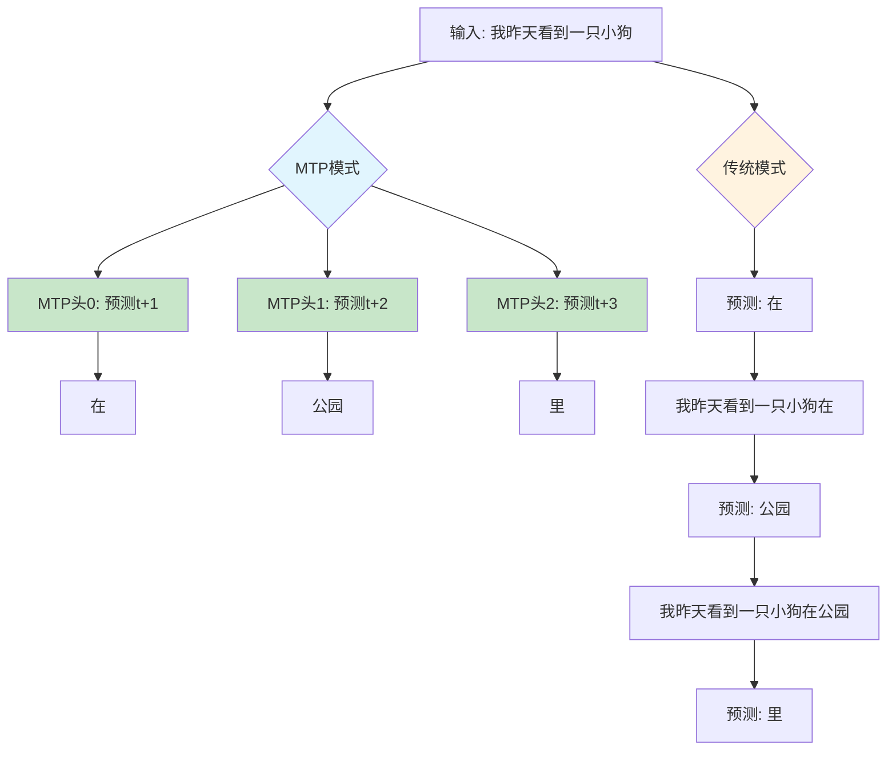

# 🚀 DeepSeek MTP: 多Token并行预测演示

> **MTP (Multi-Token Prediction)**: 让AI模型像围棋大师一样，一次看清未来多步！

## 🎯 什么是MTP？

想象你正在和朋友聊天：

```
朋友说: "我昨天看到一只小狗..."
```

**传统AI（自回归）**: 需要一个词一个词地猜
- 步骤1: 猜 "在" 
- 步骤2: 基于 "我昨天看到一只小狗在" 猜 "公园"  
- 步骤3: 基于 "我昨天看到一只小狗在公园" 猜 "里"
- 结果: "在公园里" (需要3次思考)

**MTP智能AI**: 一次性预测多个位置
- 同时预测: t+1="在", t+2="公园", t+3="里"
- 结果: "在公园里" (只需1次思考！)

## 🧠 MTP的核心思想

### 📊 并行vs串行的差异



### 🎪 MTP的魔法：推测解码 (Speculative Decoding)

MTP就像一个"预言家团队"：

1. **🔮 预测阶段 (Predict)**
   ```
   输入: "I like apples"
   MTP头0: "接下来是 and"
   MTP头1: "再接下来是 me" 
   MTP头2: "最后是 too"
   预测结果: "and me too"
   ```

2. **✅ 验证阶段 (Verify)**
   ```
   用传统方法验证: "I like apples and me too"
   逐个检查每个位置的预测是否正确
   ```

3. **🎉 接收阶段 (Accept)**
   ```
   如果验证通过: 直接接受整个序列
   如果部分错误: 接受正确的部分，从错误处继续
   ```

## 💻 代码演示

运行我们的演示代码：

```bash
python learnings/deepseeks/MTP/run_deepseek_mtp_minimal.py
```

你会看到这样的输出：

```
输入: I like apples

MTP并行预测:
  step 0 (t+1): ['and', 'too', 'you', 'me', 'I'] [0.7234, 0.1234, ...]
  step 1 (t+2): ['me', 'too', 'you', 'and', 'like'] [0.6789, 0.1987, ...]
  step 2 (t+3): ['too', 'and', 'like', 'me', 'you'] [0.8123, 0.0987, ...]

对比结果:
  传统逐步生成: I like apples -> I like apples and -> I like apples and me -> I like apples and me too
  MTP并行生成:  I like apples | and me too (一次性预测)
```

## 🏎️ MTP的优势

### ⚡ 速度提升
- **传统方法**: 3个token需要3次GPU计算
- **MTP方法**: 3个token只需要1次GPU计算 + 1次验证
- **加速比**: 2-3倍！

### 🧮 计算效率
```python
# 传统自回归 (3次前向传播)
for i in range(3):
    next_token = model.predict(sequence)
    sequence.append(next_token)

# MTP并行 (1次前向传播)
future_tokens = model.predict_multiple(sequence, steps=3)
verify_result = model.verify(sequence + future_tokens)
```

## 🔧 技术细节 (简化版)

### MTP模型结构

```
输入嵌入 → [MTP层0, MTP层1, MTP层2] → 共享输出头
           ↓
    每层包含: 注意力机制 + 前馈网络
           ↓  
    不同层预测不同时间步: t+1, t+2, t+3
```

### 关键组件

- **🎭 多头架构**: 每个MTP头专门负责一个未来时间步
- **🔄 共享参数**: 所有头共享同一个输出投影层，提高效率
- **📍 位置感知**: 通过RoPE等机制让模型知道自己在预测哪个位置

## ⚠️ 注意事项

1. **训练要求**: MTP需要特殊的训练方式，不是所有模型都支持
2. **内存开销**: 需要为多个头维护额外的计算状态
3. **验证开销**: 推测解码需要额外的验证步骤

## 🚀 实际应用

MTP在实际的大语言模型推理中能显著提升速度：

- **对话系统**: 更快的响应时间
- **文本生成**: 更高的吞吐量  
- **代码补全**: 更流畅的编程体验

---

**🎯 核心理念**: MTP让AI从"步步为营"变成"深谋远虑"，用并行计算的力量让语言生成更加高效！

---

*💡 想深入了解？运行代码，观察MTP如何一次性预测出"I like apples **and me too**"这样连贯的句子！*