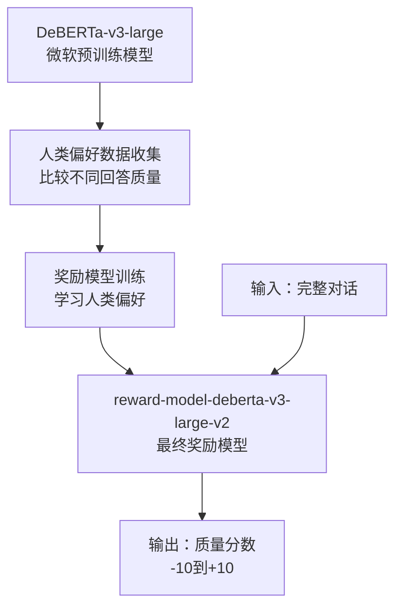
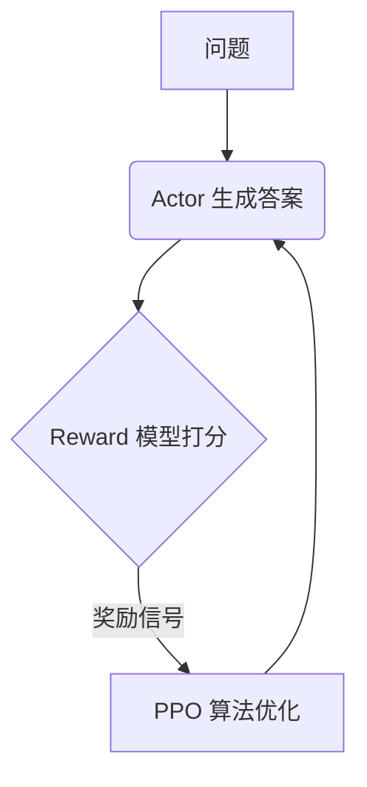

# PPO (Proximal Policy Optimization) 算法详解与调试指南

本文代码参见：[https://github.com/zysNLP/quickllm/tree/main/learnings/llm_related-main](https://github.com/zysNLP/quickllm/tree/main/learnings/llm_related-main)；感谢star。本文内容非常生动形象、但也非常长非常详细，请参照代码逐行耐心查看

本文内容后续配套课程[《AIGC大模型理论与工业落地实战》](https://edu.csdn.net/course/detail/39082)；持续更新中

## 1. PPO算法简介

近端策略优化（Proximal Policy Optimization, PPO）是OpenAI于2017年提出的一种强化学习算法，属于策略梯度（Policy Gradient）方法。PPO通过限制策略更新的幅度来保证训练的稳定性，是目前RLHF（Reinforcement Learning from Human Feedback）中最常用的算法之一。

## 2. 核心概念：4+2理解法

### 2.1 四个模型

#### 2.1.1 策略模型（Actor Model）
- **作用**：待优化的主模型，负责生成文本
- **参数更新**：✅ 参与训练，通过策略损失进行优化
- **代码位置**：`actor_model = AutoModelForCausalLM.from_pretrained(...)`

#### 2.1.2 价值模型（Critic Model）
- **作用**：评估当前状态的期望回报，预测每个token的价值
- **参数更新**：✅ 参与训练，通过价值损失进行优化
- **代码位置**：`critic_model = Critic(actor_model.base_model)`

#### 2.1.3 奖励模型（Reward Model）
- **作用**：评估生成文本的质量，提供奖励信号
- **参数更新**：❌ 不参与训练，权重固定
- **代码位置**：`reward_model = AutoModelForSequenceClassification.from_pretrained(...)`

> **注意事项**：不建议使用API形式的reward model，原因如下：
> 1. API请求耗时较长（单次请求约1-5秒），严重影响训练效率
> 2. API响应可能不稳定，容易出现解析失败的情况
> 3. 相比本地reward模型，API形式的性能差异显著
> 4. 建议使用本地reward模型进行PPO训练，以获得更好的训练效果和效率

#### 2.1.4 参考模型（Reference Model）
- **作用**：防止策略模型偏离原始模型太远，提供KL散度约束
- **参数更新**：❌ 不参与训练，权重固定
- **代码位置**：`ref_model = AutoModelForCausalLM.from_pretrained(...)`


## 3. 数学推导过程

### 3.1 基础概念

#### 3.1.1 策略与轨迹
在RLHF中：
- **策略**：我们要优化的大模型
- **轨迹**：一次完整的文本生成过程
- **状态**：当前的文本前缀
- **动作**：生成下一个token

轨迹定义：
$$
\tau = (s_0, a_0, s_1, a_1, \ldots, s_{T-1}, a_{T-1})
$$

#### 3.1.2 优化目标
基于策略的强化学习的优化目标：
$$
\arg\max_{\pi_{\theta}} J(\pi_{\theta}) = \arg\max_{\pi_{\theta}}\mathbb{E}_{\tau \sim \pi_{\theta}} [R(\tau)]
$$

### 3.2 策略梯度推导

#### 3.2.1 基本策略梯度
通过数学推导，我们可以得到策略梯度的基本形式：
$$
\nabla J(\pi_{\theta}) = \mathbb{E}_{\tau \sim \pi_{\theta}} \left[ \sum_{t=0}^{T-1} \Psi_{t} \nabla \log \pi_{\theta}(a_{t} | s_{t}) \right]
$$

其中$\Psi_t$可以有多种选择：
1. 轨迹的累积奖励
2. 轨迹的折扣奖励
3. 引入基线的奖励
4. 动作价值函数$Q^{\pi}(s_t, a_t)$
5. 优势函数$A^{\pi}(s_t, a_t)$

#### 3.2.2 优势函数（Advantage Function）
优势函数衡量某个动作相对于平均水平的优势：
$$
A_{\pi}(s_t, a_t) = Q_{\pi}(s_t, a_t) - V_{\pi}(s_t)
$$

可以简化为：
$$
A_{\pi}(s_t, a_t) = r_t + \gamma V_{\pi}(s_{t+1}) - V_{\pi}(s_t)
$$

#### 3.2.3 广义优势估计（GAE）
为了平衡偏差与方差，引入GAE：
$$
\hat{A}_t^{\text{GAE}} = \sum_{l=0}^{\infty} (\gamma \lambda)^l \delta_{t+l}
$$

其中$\delta_t = r_t + \gamma V(s_{t+1}) - V(s_t)$

- $\lambda \to 0$：高偏差，低方差
- $\lambda \to 1$：低偏差，高方差

### 3.3 重要性采样与PPO

#### 3.3.1 重要性采样
为了重复使用数据，引入重要性采样：
$$
J(\pi_{\theta}) = \mathbb{E}_{\tau \sim \pi_{\theta^{old}}} \left[ \frac{\pi_{\theta}(a_t | s_t)}{\pi_{\theta^{old}}(a_t | s_t)} A_{\pi}(s_t, a_t) \right]
$$

#### 3.3.2 裁剪机制
为了防止策略更新过大，引入裁剪机制：
$$
L^{CLIP}(\theta) = \mathbb{E}_t \left[ \min \left( r_t(\theta) A_t, \text{clip}(r_t(\theta), 1-\epsilon, 1+\epsilon) A_t \right) \right]
$$

其中$r_t(\theta) = \frac{\pi_{\theta}(a_t | s_t)}{\pi_{\theta^{old}}(a_t | s_t)}$

## 4. 训练目标与核心原理

### 4.1 PPO到底在训练什么？

**这是理解RLHF的关键问题！** 与传统的有监督学习不同，PPO没有固定的"标准答案"，而是通过**奖励信号**来指导模型学习。

#### 🎯 **训练目标**
PPO的目标是让策略模型（Actor）学会生成**更高质量的文本**，具体来说：

```python
# 传统监督学习的目标
目标：让模型输出 = 标准答案
损失：CrossEntropyLoss(模型输出, 标准答案)

# PPO的目标  
目标：让模型生成的文本获得更高的奖励分数
损失：PolicyLoss(基于奖励模型的评分和优势函数)
```

#### 🔄 **训练循环的本质**

每一轮训练都在回答这个问题：**"如何调整模型参数，让它生成更好的文本？"**

```python
# 训练前：模型对"1+1等于多少？"可能生成
"1+1等于3"  # 奖励分数：-0.5（错误答案）

# 训练后：模型对"1+1等于多少？"倾向于生成  
"1+1等于2"  # 奖励分数：+0.8（正确答案）
```

#### 📊 **没有Label，但有评分标准**

虽然没有固定的"标准答案"，但我们有**奖励模型**作为评分标准：

```python
# 在generate_experiences()中
seq_texts = actor_tokenizer.batch_decode(seqs, skip_special_tokens=True)
# seq_texts = ["问：1+1等于多少？\n答：1+1等于2", "问：..."]

reward_model_inputs = reward_tokenizer(seq_texts, return_tensors="pt", padding=True)
r = reward_model(**reward_model_inputs.to(device)).logits  # 奖励分数
```

**奖励模型的作用**：
- 输入：完整的问答对话
- 输出：质量评分（越高越好）
- 训练数据：人类标注的偏好数据（"这个回答比那个回答更好"）

#### 🎯 **优化方向**

PPO通过以下方式优化模型：

1. **生成多样化样本**：对同一个问题生成多个不同回答
2. **评估质量差异**：奖励模型给出不同回答的分数
3. **强化好的行为**：增加高分回答的生成概率
4. **抑制坏的行为**：降低低分回答的生成概率

```python
# 优化过程示例
prompt = "请问1+1等于多少？"

# 生成阶段：模型生成多个候选回答
候选1: "1+1等于2"     → 奖励分数: +0.8
候选2: "1+1等于3"     → 奖励分数: -0.5  
候选3: "这是数学问题"  → 奖励分数: +0.2

# 训练阶段：调整参数
# 增加生成候选1的概率（高奖励）
# 降低生成候选2的概率（负奖励）
# 轻微增加候选3的概率（正奖励但不高）
```

#### 🔍 **为什么这样有效？**

1. **无需人工标注答案**：只需要奖励模型评分
2. **适应开放性问题**：没有标准答案的创意性任务
3. **持续改进**：通过试错不断优化
4. **符合人类偏好**：奖励模型基于人类偏好训练

这就是为什么PPO能够训练出ChatGPT这样的对话模型——它不是在学习"标准答案"，而是在学习"如何生成人类喜欢的回答"。

#### 🎯 **prompt_list的作用**

在代码中，`prompt_list`是训练数据的核心：

```python
prompt_list = [
    '请问1+1等于多少？',
    'PowerShell，如何知道BIOS中的虚拟化是否已禁用',
    '为什么人们喜欢在水族馆里游泳，而不是在游泳池里？',
    '你是一位营销专家。为Instagram reels写30个带有营销技巧的脚本。',
    # ... 更多提示词
]
```

**prompt_list的三个关键作用：**

1. **提供训练场景**：这些提示词代表了我们希望模型能够处理的各种问题类型
   - 数学问题：`'请问1+1等于多少？'`
   - 技术问题：`'PowerShell，如何知道BIOS中的虚拟化是否已禁用'`
   - 创意问题：`'你是一位营销专家...'`

2. **生成训练样本**：每个提示词会被用来生成多个回答样本
   ```python
   # 每个提示词生成2个样本 (n_samples_per_prompt=2)
   # 8个提示词 × 2个样本 = 16个训练样本
   ```

3. **定义优化方向**：模型会学习在这些特定场景下生成更好的回答

**简单来说**：`prompt_list`就是"考试题目"，模型通过不断练习这些题目来提高回答质量。

#### 🔄 **训练前后模型的区别**

这是一个非常重要的概念！让我们清楚地区分这些模型：

##### **训练开始时的模型状态：**
```python
# 初始化时，这两个模型是相同的
actor_model = AutoModelForCausalLM.from_pretrained('Qwen2.5-0.5B-Instruct')  # 会被训练
ref_model = AutoModelForCausalLM.from_pretrained('Qwen2.5-0.5B-Instruct')    # 保持不变
```

##### **训练过程中的变化：**
```python
# 训练循环中
for episode in range(episodes):
    # actor_model的参数会不断更新
    policy_loss.backward()
    optimizer_actor.step()  # ← 只有actor_model的参数在变化
    
    # ref_model的参数始终保持初始状态，从不更新
```

##### **训练完成后的区别：**

| 模型 | 训练前状态 | 训练后状态 | 变化 |
|------|------------|------------|------|
| **actor_model** | Qwen2.5原始模型 | **优化后的模型** | ✅ 参数已更新 |
| **ref_model** | Qwen2.5原始模型 | Qwen2.5原始模型 | ❌ 参数未变化 |

##### **具体的能力差异示例：**

**训练前（两个模型相同）：**
```python
prompt = "请问1+1等于多少？"

# actor_model和ref_model都可能生成：
"1+1等于3"     # 错误回答
"这是数学题"   # 模糊回答  
"1+1等于2"     # 正确回答（概率较低）
```

**训练后：**
```python
prompt = "请问1+1等于多少？"

# ref_model（未训练）仍然可能生成：
"1+1等于3"     # 错误回答
"这是数学题"   # 模糊回答

# actor_model（已训练）更倾向于生成：
"1+1等于2"     # 正确回答（概率大幅提高）
```

##### **为什么需要保留ref_model？**

1. **KL散度约束**：防止actor_model偏离原始模型太远
   ```python
   kl = compute_approx_kl(action_log_probs, ref_action_log_probs, action_mask)
   ```

2. **稳定性保证**：确保模型不会"忘记"原有的语言能力

3. **基准对比**：衡量训练的效果

##### **最终得到的"新模型"**

训练完成后，我们得到的**有价值的模型**是：
- **actor_model**：这是经过PPO优化的新模型，具有更好的回答质量
- **critic_model**：辅助训练的价值评估模型

**使用时**：
```python
# 保存训练好的模型
actor_model.save_pretrained('./trained_ppo_model')

# 后续使用
trained_model = AutoModelForCausalLM.from_pretrained('./trained_ppo_model')
# 这个模型现在能够生成更高质量的回答！
```

## 5. 算法流程

### 5.1 整体流程
```
1. 初始化四个模型
2. for episode in range(episodes):
   3. 生成样本（采样阶段）
   4. 计算奖励和优势
   5. 更新策略和价值模型
   6. 清空经验池
```

### 5.2 详细步骤

**PPO训练就像一个智能文本生成教练在指导学生生成回答的过程：**

想象有一个**学生（策略模型）**正在学习生成文本，旁边坐着**三位老师**：
- **学生**（策略模型）：负责实际生成回答，这是我们要优化的主要对象
- **评分老师**（价值模型）：边生成边预测"这样生成下去能得多少分"
- **质量老师**（奖励模型）：看完整个生成结果后给出最终质量评分
- **标准老师**（参考模型）：代表学生的"原始水平"，防止风格变化太大

整个训练流程就是：让学生生成回答→三位老师协作评估→根据评估结果指导学生改进→重复这个过程，最终让学生的文本生成能力越来越好。

#### 步骤1：样本生成（`generate_samples`）

**这一步就像"让学生们生成回答"：**

给学生们8个问题，每个问题让他们生成2个回答（n_samples_per_prompt=2），总共得到16个文本样本。为了防止电脑"累坏"，我们每次只让2个学生同时生成（micro_rollout_batch_size=2）。每个样本都有固定的格式：提示词部分最多256个字符，生成部分最多50个字符，最终每个样本总长度统一为306个字符。

最重要的是，我们要清楚记录哪些字符是"真正的内容"（attention_mask），哪些字符是"需要评分的生成部分"（action_mask）。这样后续的评分和指导才能精准有效。

##### 采样流程详解

`generate_samples`函数是PPO算法中的核心采样环节，负责使用策略模型生成训练数据。以下是详细的实现过程：

###### 1. 提示词扩展
```python
# 输入：prompts = ['问题1', '问题2', ..., '问题8']  # rollout_batch_size = 8
# n_samples_per_prompt = 2，表示每个提示词生成2个样本
all_prompts = sum([[prompt]*n_samples_per_prompt for prompt in prompts], [])
# 结果：all_prompts = ['问题1', '问题1', '问题2', '问题2', ..., '问题8', '问题8']  # 总共16个样本
```

**目的**：通过对每个提示词进行多次采样，增加数据的多样性和训练的稳定性。

###### 2. 分批处理
```python
# micro_rollout_batch_size = 2，将16个样本分成8个批次
for i in range(0, len(all_prompts), micro_rollout_batch_size):  # i = 0, 2, 4, 6, 8, 10, 12, 14
    prompts = all_prompts[i:i+micro_rollout_batch_size]  # 每次取2个样本
```

**目的**：控制显存使用，避免一次性处理太多样本导致显存溢出。

###### 3. 文本编码
```python
inputs = actor_tokenizer(prompts, padding='max_length', max_length=max_length, truncation=True, return_tensors='pt')
input_ids = inputs['input_ids']  # shape: [2, 256]
```

**数据流**：
- 输入：2个文本提示词
- 输出：`input_ids` tensor，形状为 `[batch_size=2, max_length=256]`
- 填充方式：left padding（因为设置了`actor_tokenizer.padding_side = 'left'`）

###### 4. 文本生成
```python
seqs = model.generate(**inputs.to(device), 
                    max_new_tokens = max_new_tokens,  # 50
                    eos_token_id = eos_token_id, 
                    pad_token_id = pad_token_id)
# 输出：seqs shape = [2, 256+50] = [2, 306]（理想情况）
```

##### 256+50的详细解释

这里容易产生混淆，解释一下为什么要**加**50：

**第一步：Tokenizer处理（256）**
```python
# 代码：inputs = actor_tokenizer(prompts, padding='max_length', max_length=max_length, truncation=True, return_tensors='pt')
# 输入：prompts = ["请问1+1等于多少？", "为什么人们喜欢..."]
# 输出：input_ids shape = [2, 256]

# 具体过程：
原始提示词长度: 可能是[20, 45, 30, ...]个token（长度不一）
                ↓ tokenizer处理
填充后长度:     [256, 256, 256, ...]个token（统一长度）
```

**第二步：模型生成（256 → 306）**
```python
# 代码：seqs = model.generate(**inputs.to(device), max_new_tokens = max_new_tokens)
# 输入：input_ids shape = [2, 256]  ← 这是提示词部分
# 输出：seqs shape = [2, 306]      ← 这是提示词+生成内容

# 具体过程：
输入序列(256):    [pad, pad, 请, 问, 1, +, 1, 等, 于, 多, 少, ？, pad, pad, ...]
                      ↓ model.generate过程
输出序列(306):    [pad, pad, 请, 问, 1, +, 1, 等, 于, 多, 少, ？, pad, pad, ...] + [答, 案, 是, 2, eos, pad, ...]
                  |<------------ 原来的256个token ----------->|  |<-- 新生成的50个token -->|
```

**关键理解**：
1. **Tokenizer的max_length=256**：只是限制**输入提示词**的最大长度
2. **Generate的max_new_tokens=50**：在输入基础上**额外生成**最多50个新token
3. **最终序列长度 = 输入长度 + 生成长度 = 256 + 50 = 306**

**代码验证**：
```python
# 从代码中可以看到：
input_ids = inputs['input_ids']  # [2, 256] ← 只有提示词
seqs = model.generate(...)       # [2, 306] ← 提示词 + 生成内容
ans = seqs[:, input_ids.size(1):]  # [2, 50] ← 只提取生成的部分
# ans = seqs[:, 256:]  等价于提取第256位置之后的所有内容
```

**为什么不是256而是256+50**：
- ❌ **错误理解**：生成时替换掉原来的内容，总长度还是256
- ✅ **正确理解**：生成时在原内容**后面追加**新内容，总长度变成306

这就像写作文一样：
- 提示词（输入部分）：256个字符
- 生成内容（输出部分）：最多再生成50个字符  
- 完整样本：提示词+生成内容 = 256+50 = 306个字符

###### 5. 序列长度标准化
```python
if seqs.size(1) >= max_new_tokens + max_length:  # 306
    # 如果生成长度超过预期，截取前306个token
    seqs = seqs[:, :max_new_tokens + max_length]
else:
    # 如果生成长度不够，用pad_token_id填充到306个token
    seqs = torch.cat([seqs, torch.full((seqs.size(0), max_new_tokens + max_length - seqs.size(1)), 
                                     fill_value=pad_token_id, device=seqs.device)], dim=1)
```

**目的**：确保所有序列长度一致，便于批处理。

###### 6. 掩码生成
```python
# 注意力掩码：标识哪些位置是真实token（非填充符）
attention_mask = (seqs.ne(pad_token_id)).to(dtype=torch.long)  # [2, 306]

# 提取生成部分（生成的新token）
ans = seqs[:, input_ids.size(1):]  # [2, 50]

# 动作掩码：标识哪些生成的token是有效的（非结束符和非填充符）
action_mask = (ans.ne(eos_token_id) & ans.ne(pad_token_id)).to(dtype=torch.long)  # [2, 50]
```

##### 掩码生成详细示例

让我们用一个简化的例子来理解掩码的作用：

###### 示例场景设定
假设我们有一个简化的例子，为了方便理解，我们设定：
```python
# 统一例子设定（简化版，便于理解）
max_length = 12        # 输入最大长度
max_new_tokens = 8     # 最多生成8个新token

# 输入数据（来自generate_samples）
seqs = [
    # 样本1：数学问答，20个token
    [0, 0, 请, 问, 1, +, 1, 等, 于, 多, 少, ？, 答, 案, 是, 2, ，, 很, 简, 单],
    
    # 样本2：常识问答，20个token  
    [0, 0, 为, 什, 么, 天, 空, 是, 蓝, 色, 的, ？, 因, 为, 散, 射, 光, 线, <eos>, 0]
]
# 实际形状：[2, 20]（简化版，实际代码中是[2, 306]）
# 前12个token是提示词部分，后8个是生成内容部分

# 具体分解：
# 样本1："请问1+1等于多少？ → 答案是2，很简单"  （达到长度限制被截断）
# 样本2："为什么天空是蓝色的？ → 因为散射光线<eos>"  （模型主动结束）
```

**重要说明：两个样本结束方式不同的原因**

在实际PPO训练中，生成结束有三种常见情况：

1. **自然结束**（样本2）：模型认为回答完整，主动生成`<eos>`
2. **长度截断**（样本1）：达到`max_new_tokens`限制，强制停止生成
3. **其他停止符**：遇到其他预定义的停止token

这种差异是**正常现象**，action_mask的设计正是为了处理这种情况：
- 样本1：`action_mask = [1, 1, 1, 1, 1, 1, 1, 1]` （所有生成token都参与训练）
- 样本2：`action_mask = [1, 1, 1, 1, 1, 1, 0, 0]` （`<eos>`和padding被mask掉）

**1. Attention Mask生成**：
```python
attention_mask = (seqs.ne(pad_token_id)).to(dtype=torch.long)
# 样本1: seqs[0]:      [0, 0, 请, 问, 1, +, 1, 等, 于, 多, 少, ？, 答, 案, 是, 2, ，, 很, 简, 单]
# ne(0):               [F, F, T, T, T, T, T, T, T, T, T, T, T, T, T, T, T, T, T, T]  # ne = not equal
# attention_mask[0]:   [0, 0, 1, 1, 1, 1, 1, 1, 1, 1, 1, 1, 1, 1, 1, 1, 1, 1, 1, 1]

# 样本2: seqs[1]:      [0, 0, 为, 什, 么, 天, 空, 是, 蓝, 色, 的, ？, 因, 为, 散, 射, 光, 线, <eos>, 0]
# ne(0):               [F, F, T, T, T, T, T, T, T, T, T, T, T, T, T, T, T, T,   T,   F]
# attention_mask[1]:   [0, 0, 1, 1, 1, 1, 1, 1, 1, 1, 1, 1, 1, 1, 1, 1, 1, 1,   1,   0]
```

**作用**：告诉Transformer模型哪些位置是真实内容（1），哪些是填充（0）
- 样本1：位置0,1是padding，其余都是真实内容
- 样本2：位置0,1,19是padding，其余都是真实内容

**2. Action Mask生成**：
```python
# 先提取生成的部分
ans = seqs[:, input_ids.size(1):]  # seqs[:, 12:]
# 样本1: ans[0] = [答, 案, 是, 2, ，, 很, 简, 单]    # 长度截断，无结束符
# 样本2: ans[1] = [因, 为, 散, 射, 光, 线, <eos>, 0]  # 模型主动结束，有结束符

# 生成action_mask
action_mask = (ans.ne(eos_token_id) & ans.ne(pad_token_id)).to(dtype=torch.long)

# 样本1的action_mask计算：
# ans[0]:         [答, 案, 是, 2, ，, 很, 简, 单]
# ne(eos):        [T,  T,  T, T,  T, T,  T,  T]   # 不等于结束符（因为没有eos）
# ne(pad):        [T,  T,  T, T,  T, T,  T,  T]   # 不等于填充符
# 逻辑与(&):       [T,  T,  T, T,  T, T,  T,  T]
# action_mask[0]: [1,  1,  1, 1,  1, 1,  1,  1]   # 所有token都参与训练

# 样本2的action_mask计算：
# ans[1]:         [因, 为, 散, 射, 光, 线, <eos>, 0]
# ne(eos):        [T,  T,  T,  T,  T,  T,   F,   T]  # 不等于结束符
# ne(pad):        [T,  T,  T,  T,  T,  T,   T,   F]  # 不等于填充符
# 逻辑与(&):       [T,  T,  T,  T,  T,  T,   F,   F]
# action_mask[1]: [1,  1,  1,  1,  1,  1,   0,   0]  # <eos>和padding被mask
```

**作用**：标识哪些生成的token是有效的PPO训练动作

**样本1**（长度截断）：
- 位置0-7（token 答,案,是,2,，,很,简,单）：有效生成内容，action_mask=1，参与PPO损失计算

**样本2**（自然结束）：
- 位置0-5（token 因,为,散,射,光,线）：有效生成内容，action_mask=1，参与PPO损失计算  
- 位置6-7（token <eos>,0）：结束符和填充符，action_mask=0,不参与损失计算

**关键理解**：不同的结束方式导致不同的mask模式，但action_mask机制都能正确处理

##### 掩码在PPO中的具体作用

**Attention Mask**：
```python
# 在模型前向传播时使用
output = model(seqs, attention_mask=attention_mask)
# 确保模型只对真实内容进行attention计算，忽略padding部分
```

**Action Mask**：
```python
# 在计算策略损失时使用
policy_loss = compute_policy_loss(log_probs, old_log_probs, advantages, action_mask=action_mask)
# 只对有效生成的token计算损失，避免对结束符和填充符进行不必要的优化

# 在计算价值损失时使用  
value_loss = compute_value_loss(values, old_values, returns, action_mask=action_mask)
# 确保价值函数只评估有效的生成动作
```

##### 为什么需要两种掩码？

1. **Attention Mask**：模型层面的掩码
   - 确保Transformer正确处理变长序列
   - 防止模型关注填充内容
   - 适用于所有使用该序列的模型（actor, critic, ref）

2. **Action Mask**：训练层面的掩码  
   - 确保PPO只优化有意义的生成动作
   - 避免对特殊token（eos, pad）进行错误的策略更新
   - 提高训练的精确性和稳定性

通过这种精确的掩码机制，PPO能够正确区分不同类型的token，确保训练过程只关注真正需要优化的生成内容。


#### 步骤2：经验生成（`generate_experiences`）

**这一步就像"三位老师协作分析每个文本样本"：**

现在我们有了16个文本样本，三位老师开始分工合作分析：

1. **学生**（策略模型）：分析"学生生成每个字时的把握程度"，记录每个字的"确信度"
2. **标准老师**（参考模型）：分析"按照原始水平会怎么生成"，用于对比风格变化
3. **评分老师**（价值模型）：预测"生成到每个字时的期望得分"，实时评估生成进展
4. **质量老师**（奖励模型）：给出"整个文本的最终质量分数"，提供权威评价

最终，这三位老师的分析结果会被整合成一套完整的"文本评估报告"，包含每个字的生成信心、期望得分、实际奖励和学习优势。这份报告将指导下一轮的生成改进。

##### 经验生成详细流程

`generate_experiences`函数将采样得到的`Samples`转换为包含奖励、优势等信息的`Experience`。让我们用具体例子来理解每一步：

###### 第1步：计算策略模型概率 - "我生成这个词的把握有多大？"

**为什么要算概率？**
想象你在生成回答，写下每个token的时候，你心里都有一个"确信度"。PPO需要知道模型生成每个token时有多确信，这样才能判断这个选择是好是坏。

```python
# 模型前向传播
output = actor_model(seqs, attention_mask=attention_mask)
logits = output.logits  # [2, 20, vocab_size] 每个位置对词汇表中所有词汇的评分

# 具体例子：看样本1在位置12的情况
# 回顾样本1：[0, 0, 请, 问, 1, +, 1, 等, 于, 多, 少, ？, 答, 案, 是, 2, ，, 很, 简, 单]
#            0  1  2  3  4  5  6   7   8   9  10  11 12   13 14  15 16  17  18  19
#                                                    ↑ 位置12是"答"

# 在位置12，模型需要预测下一个token（即位置12的token"答"）
# 模型对词汇表中所有15万个词汇都给出评分：
logits[0, 11, :] = [  # 注意：用位置11来预测位置12的token
    -5.2,  # token_id=100 ("的") - 不太合适  
    -3.1,  # token_id=200 ("结") - 还可以，但不是最佳
     2.8,  # token_id=300 ("答") - 评分最高 ← 模型最终选择了这个
    -4.5,  # token_id=400 ("就") - 不太合适
     1.2,  # token_id=500 ("回") - 评分不错，但不如"答"
    ...    # 其他14万9995个词汇的评分
]

# 解释：在"请问1+1等于多少？"后面，模型认为：
# "答"案最合适（2.8分） > "回"答次之（1.2分） > "结"果一般（-3.1分）

# 转换为概率分布
log_probs = F.log_softmax(logits[:, :-1, :], dim=-1)  # [2, 19, vocab_size]
# log_probs[0, 12, 300] = -0.15  # 生成"答"的对数概率

# 提取实际生成token的概率
# 现在我们有了每个位置对所有词汇的概率，但我们只关心实际选择的那个词汇的概率

# 先看看我们要从哪里"捞取"概率：
# log_probs.shape = [2, 305, 151936]  # [batch_size, seq_len-1, vocab_size]
# 这是一个巨大的3D张量，包含每个位置对每个词汇的概率

# 再看看我们的"索引"（要捞取哪些词汇）：
# seqs[:, 1:].shape = [2, 305]  # 每个位置实际选择的token_id
# 例如：seqs[0, 1:] = [0, 请,  问,  1,   +,   1,   等,   于,  答,  案,   是,  2,  <eos>,  0, 0, ...]
#      对应token_id: [0, 101, 102, 103, 104, 103, 105, 106, 300, 301, 302, 303, 2,     0, 0, ...]

# gather操作的具体过程：
# 对于样本0的位置11（预测位置12的"答"）：
# - log_probs[0, 11, :] 包含对151936个词汇的概率：[-8.1, -6.0, ..., -0.1, ..., -1.7]
# - seqs[0, 12] = 300  # "答"的token_id是300
# - gather会取出 log_probs[0, 11, 300] = -0.1  # "答"这个词的概率

# unsqueeze(-1) 的作用：
# seqs[:, 1:].shape = [2, 305] → seqs[:, 1:].unsqueeze(-1).shape = [2, 305, 1]
# 这是为了匹配gather函数的要求（需要在最后一个维度上指定索引）

log_probs_labels = log_probs.gather(dim=-1, index=seqs[:, 1:].unsqueeze(-1))
# 结果：log_probs_labels.shape = [2, 305, 1]
# 每个位置只保留实际选择token的概率，其他151935个词汇的概率都被丢弃了

# 具体数值示例：
# log_probs_labels[0] = [
#     [-8.2],  # 位置0选择token_id=0的概率
#     [-0.5],  # 位置1选择"请"的概率  
#     [-1.2],  # 位置2选择"问"的概率
#     ...
#     [-0.1],  # 位置11选择"答"的概率
#     [-0.4],  # 位置12选择"案"的概率
#     ...
# ]

action_log_probs = log_probs_labels.squeeze(-1)[:, -8:]  # 只要生成部分[2, 8]
# action_log_probs[0] = [-0.15, -0.23, -0.18, -0.12, -0.08, -0.05, -0.03, -0.02]  # "答案是2，很简单"的概率
```

**直观理解**：就像记录"我写下'答案是2，很简单'时每个字的自信程度"

##### 🔍 核心三句代码详细解析

很多同学对上面的三句核心代码感到困惑，让我们逐句深入解析：

**第1句：`log_probs = F.log_softmax(logits[:, :-1, :], dim=-1)`**

🎯 **作用：把模型的"评分"转成"概率"**

```python
# 假设模型对某个位置的词汇表评分如下：
logits[0, 11, :] = [
    -5.2,  # token_id=100 ("的") 
    -3.1,  # token_id=200 ("结") 
     2.8,  # token_id=300 ("答") ← 评分最高，模型最想选这个
    -4.5,  # token_id=400 ("就") 
     1.2,  # token_id=500 ("回") 
    ...    # 其他14万+词汇的评分
]

# F.log_softmax 把这些原始评分转换成标准化的对数概率：
log_probs[0, 11, :] = [
    -8.1,  # P("的") = 很小概率
    -6.0,  # P("结") = 小概率  
    -0.1,  # P("答") = 大概率 ← 对应最高评分
    -7.4,  # P("就") = 很小概率
    -1.7,  # P("回") = 中等概率
    ...
]
```

**🔑 关键理解：**
- `[:, :-1, :]`：去掉最后一个位置，因为最后位置后面没有token需要预测
- `dim=-1`：在词汇表维度(151936个词汇)上做softmax，确保每个位置所有词汇概率和为1
- 为什么用log_softmax而不是softmax？因为概率很小时，取对数更数值稳定

**第2句：`log_probs_labels = log_probs.gather(dim=-1, index=seqs[:, 1:].unsqueeze(-1))`**

🎯 **作用：从15万个概率中，精确提取实际生成token的概率**

```python
# 理解gather操作的关键：这是一个"按索引取值"的过程

# 输入数据的维度：
log_probs.shape = [2, 305, 151936]  # [batch_size, seq_len-1, vocab_size]
seqs[:, 1:].shape = [2, 305]       # [batch_size, seq_len-1] 实际选择的token_id

# 具体例子：假设我们要处理位置11（预测位置12的token）
# log_probs[0, 11, :] = [-8.1, -6.0, -7.4, ..., -0.1, ..., -1.7]  # 对151936个词汇的概率
#                        词汇0  词汇1  词汇2      词汇300     词汇500
#                                              ↑这是"答"

# seqs[0, 12] = 300  # 实际选择的是token_id=300（"答"）

# gather操作就是：
# "我要从log_probs[0, 11, :]这个长度为151936的数组中，取出第300个位置的值"
# 结果：log_probs_labels[0, 11] = log_probs[0, 11, 300] = -0.1

# unsqueeze(-1)的必要性：
# seqs[:, 1:].shape = [2, 305] → [2, 305, 1]  # gather需要最后一个维度来指定索引

# 完整的gather过程：
# 对于每个样本的每个位置，都执行这样的"按索引取值"：
log_probs_labels[0] = [
    [log_probs[0, 0, seqs[0, 1]]],    # = [-8.2]  位置0选择token的概率
    [log_probs[0, 1, seqs[0, 2]]],    # = [-0.5]  位置1选择"请"的概率  
    [log_probs[0, 2, seqs[0, 3]]],    # = [-1.2]  位置2选择"问"的概率
    ...
    [log_probs[0, 11, seqs[0, 12]]],  # = [-0.1]  位置11选择"答"的概率
    [log_probs[0, 12, seqs[0, 13]]],  # = [-0.4]  位置12选择"案"的概率
    ...
]

# 最终结果：log_probs_labels.shape = [2, 305, 1]
# 从原来的[2, 305, 151936]压缩到[2, 305, 1]，只保留有用信息！
```

**🔑 关键理解：**
- `gather`就像"按索引取值"，从巨大的[batch_size, seq_len, vocab_size]张量中按索引精确提取
- `unsqueeze(-1)`是为了匹配gather函数的维度要求（添加一个维度）
- 这步将[2, 305, 151936]降到[2, 305, 1]，只保留有用信息

**第3句：`action_log_probs = log_probs_labels.squeeze(-1)[:, -num_actions:]`**

🎯 **作用：只保留"生成部分"的概率，忽略prompt输入部分**

```python
# log_probs_labels包含了完整序列每个位置的概率：
log_probs_labels[0] = [-8.2, -0.5, -1.2, -2.3, -1.8, -0.9, -1.1, -0.8, -0.1, -0.4, -0.3, -0.7, -0.2, -5.0, -8.0]
#                      |------------ prompt部分 -----------|  |------- 生成部分(我们关心的) -------|

# 假设 num_actions = 8 (最后8个token是模型生成的)
# [:, -num_actions:] 只取最后8个：
action_log_probs[0] = [-0.1, -0.4, -0.3, -0.7, -0.2, -5.0, -8.0, 0.0]
#                      "答"  "案"  "是"   "2"  <eos> pad  pad  pad
#                      高概率     低概率(padding)

# squeeze(-1) 移除最后一个大小为1的维度：[2, 305, 1] → [2, 305]
```

**🔑 关键理解：**

- PPO只关心模型"主动生成"的部分，用户输入的prompt不需要优化
- 这些概率值将用于计算policy loss，指导模型学习哪些选择好，哪些选择不好
- padding部分概率很低(-8.0)是正常的，因为不应该生成padding token

##### 📊 完整转换流程总结

```python 
# 数据转换全流程：
原始logits      [2, 306, 151936]  # 每个位置对15万词汇的原始评分
    ↓ F.log_softmax (第1句)
标准化概率       [2, 305, 151936]  # 每个位置对15万词汇的标准化概率  
    ↓ .gather() (第2句)  
实际选择概率     [2, 305, 1]       # 每个位置实际选择token的概率
    ↓ .squeeze()[:, -50:] (第3句)
最终训练信号     [2, 50]           # 只保留生成部分，供PPO训练使用
```

**💡 类比理解：**
这就像考试阅卷过程：
1. **第1句**：把老师的主观评分转成标准化分数
2. **第2句**：从每道题的所有选项中，提取学生实际选择的答案分数  
3. **第3句**：只关注学生自己答的题目，忽略题目本身

通过这三步转换，我们得到了模型对每个生成token的"确信度"，这正是PPO算法进行策略优化所需要的核心信号！

###### 第2步：计算参考模型概率 - "原来的我会怎么生成？"

**为什么需要参考模型？**
想象你在学习写作，老师不希望你的文风变化太大。参考模型就是"原来的你"，用来确保训练后的模型不会变得面目全非。

```python
# 参考模型的想法
ref_output = ref_model(seqs, attention_mask=attention_mask)
ref_action_log_probs = ...  # 同样的计算过程

# 对比例子：
action_log_probs[0]     = [-0.15, -0.23, -0.18, -0.12, -0.08, -0.05, -0.03, -0.02]  # 当前模型："答案是2，很简单"
ref_action_log_probs[0] = [-0.18, -0.25, -0.20, -0.14, -0.10, -0.07, -0.05, -0.03]  # 参考模型："答案是2，很简单"

# 差异不大 = 好！说明没有偏离太远
# 差异很大 = 危险！需要KL散度来约束
```

###### 第3步：计算价值函数 - "我觉得这样生成能得多少分？"

**为什么需要价值函数？**
就像学生生成回答时会预估"这样生成能得多少分"，价值模型预测每个生成动作的"期望回报"。

```python
# Critic模型的内心评估
hidden_state = critic_model.base_model(seqs, attention_mask=attention_mask).last_hidden_state
# hidden_state[0, 12, :] = [0.1, -0.3, 0.8, ...]  # 位置12的隐藏状态

value_output = critic_model.value_head(hidden_state)  # [2, 20, 1]
values = value_output.squeeze(-1)[:, -8:]  # [2, 8] 只看生成部分

# 具体数值例子：
# 理想化示例（便于理解）：
values[0] = [0.8, 0.9, 1.2, 1.5, 1.3, 1.0, 0.8, 0.6]  # 预测"答案是2，很简单"每步的价值

# 实际训练输出（更真实）：
values[0] = [-4.92, -0.66, 4.69, 6.51, 0.41, -1.06, -5.91, -2.74, ...]
# 解释实际输出：
# 1. 负值很正常：大部分位置有KL惩罚，期望奖励为负
# 2. 正值表示重要：某些关键位置（如4.69, 6.51）被认为很有价值  
# 3. 数值范围大：模型在学习区分不同位置的重要性
# 4. 符合奖励设计：只有少数位置能获得正奖励，大部分位置是KL惩罚
```

**直观理解**：价值模型像一个"内部评委"，实时评估"这样生成下去能得几分"

###### 第4步：计算奖励模型分数 - "文本整体能打多少分？"

**为什么最后才用奖励模型？**
奖励模型像"外部老师"，只有看到完整文本才能打分，不像价值模型可以中途评估。

```python
# 把token序列还原成文本
seq_texts = [
    "请问1+1等于多少？答案是2，很简单",
    "为什么天空是蓝色的？因为散射光线"
]

# 奖励模型打分
reward_model_inputs = reward_tokenizer(seq_texts, ...)
r = reward_model(**reward_model_inputs).logits  # [2, 1]

# 具体分数例子：
r = [[1.2],   # 样本1："请问1+1等于多少？答案是2，很简单" → 1.2分（答对了，表达清楚）
     [0.3]]   # 样本2："为什么天空是蓝色的？因为散射光线" → 0.3分（回答不完整）
```

###### 第5步：计算KL散度 - "我变化得太大了吗？"

**为什么要计算KL散度？**
就像学生写作风格不能突然大变，KL散度衡量"新模型与原模型的差异程度"。

```python
kl = compute_approx_kl(action_log_probs, ref_action_log_probs, action_mask)

# 具体计算：
log_ratio = action_log_probs - ref_action_log_probs
# log_ratio[0] = [-0.15-(-0.18), -0.23-(-0.25), ...] = [0.03, 0.02, 0.02, 0.02, 0.02, 0.02, 0.02, 0.01]

# 解释：
# 接近0 = 没什么变化，安全
# 远离0 = 变化很大，危险
```

##### ⚠️ **重要理解：为什么训练初期KL散度为0？**

**你可能会发现一个现象**：在训练刚开始时，`action_log_probs`和`ref_action_log_probs`完全相同！

```python
# 调试时经常看到：
action_log_probs[0][0] = tensor(-0.3449, device='cuda:0')
ref_action_log_probs[0][0] = tensor(-0.3449, device='cuda:0')
# 完全一样！KL散度 = 0

# 这是为什么？
```

**🔍 原因分析：**

1. **模型初始化相同**：
```python
# 在代码中，actor和ref模型都从同一个预训练模型初始化：
actor_model = AutoModelForCausalLM.from_pretrained('/path/to/Qwen2.5-0.5B-Instruct')
ref_model = AutoModelForCausalLM.from_pretrained('/path/to/Qwen2.5-0.5B-Instruct')
# 两个模型的参数完全相同！
```

2. **训练前的状态**：
```python
# 在generate_experiences阶段：
# - actor_model.eval()  # 推理模式，不更新参数
# - ref_model.eval()    # 推理模式，永远不更新参数

# 由于参数相同 + 输入相同 + 计算过程相同 = 输出必然相同
# 所以：action_log_probs == ref_action_log_probs
# 因此：KL散度 = 0
```

3. **训练后的变化**：
```python
# 经过几轮train_step后：
# - actor_model的参数被optimizer_actor更新了
# - ref_model的参数保持不变（没有优化器）

# 现在再次generate_experiences时：
action_log_probs[0][0] = tensor(-0.2891, device='cuda:0')  # actor模型更新后的输出
ref_action_log_probs[0][0] = tensor(-0.3449, device='cuda:0')  # ref模型保持原样

# 差异出现了！KL散度 > 0
log_ratio = -0.2891 - (-0.3449) = 0.0558  # 不再是0
```

**📈 训练过程中的KL散度变化：**

```python
# 训练轮次 0：KL = 0.0000（完全相同）
# 训练轮次 1：KL = 0.0123（开始有差异）  
# 训练轮次 5：KL = 0.0456（差异增大）
# 训练轮次 10：KL = 0.0789（需要约束了）
# 训练轮次 20：KL = 0.1234（如果没有KL惩罚，可能过大）
```

**🎯 这说明了什么？**

1. **PPO的渐进性**：模型不是一下子变化很大，而是逐步优化
2. **KL约束的必要性**：随着训练进行，需要KL惩罚来防止偏离太远
3. **参考模型的作用**：作为"锚点"，确保优化不会失控
4. **调试的正常性**：如果你在第一轮训练前调试，看到KL=0是完全正常的

**💡 实际意义：**
- **训练初期**：模型谨慎探索，变化很小
- **训练中期**：模型找到改进方向，开始有明显变化  
- **训练后期**：KL约束发挥作用，防止过度优化

这就是为什么PPO被称为"稳定"的强化学习算法——它通过参考模型和KL约束，确保了训练过程的可控性！

###### 第6步：构建最终奖励 - "综合考虑打分和约束"

**奖励设计哲学**：既要鼓励好的生成（奖励模型分数），又要防止变化过大（KL惩罚）。

```python
# 每个位置的KL惩罚
kl_divergence_estimate = -0.1 * kl  # kl_ctl=0.1
# kl_divergence_estimate[0] = [-0.003, -0.002, -0.002, -0.002, -0.002, -0.002, -0.002, -0.001]  # 每个位置都有小惩罚

# 最终奖励构建
rewards = kl_divergence_estimate.copy()
# 在最后一个有效位置加上奖励模型分数
rewards[0][-1] += 1.2  # 样本1的最后位置：-0.001 + 1.2 = 1.199
rewards[1][-1] += 0.3  # 样本2的最后位置：-0.002 + 0.3 = 0.298

# 最终奖励：
rewards[0] = [-0.003, -0.002, -0.002, -0.002, -0.002, -0.002, -0.002, 1.199]  # "答案是2，很简单"
rewards[1] = [-0.002, -0.003, -0.001, -0.002, -0.002, -0.002, 0.298, 0.000]  # "因为散射光线<eos><pad>"
```

**设计逻辑**：
- 前面几步：小惩罚（防止偏离）
- 最后一步：大奖励（鼓励好结果）

###### 第7步：计算优势函数 - "每一步比期望好多少？"

**优势函数的直观含义**：如果价值模型预测能得1分，但实际得了1.5分，那优势就是+0.5。

```python
# GAE反向计算（从最后往前）
# 使用实际的价值函数输出：
# values[0] = [-4.92, -0.66, 4.69, 6.51, 0.41, -1.06, -5.91, -2.74]
# rewards[0] = [-0.003, -0.002, -0.002, -0.002, -0.002, -0.002, -0.002, 1.199]

# 从t=7开始（最后一步）：
delta_7 = rewards[0][7] + gamma * 0 - values[0][7]  # 1.199 + 0 - (-2.74) = 3.939
advantage_7 = delta_7 = 3.939  # 比预期好很多！

# t=6：
delta_6 = rewards[0][6] + gamma * values[0][7] - values[0][6]  # -0.002 + 0.1*(-2.74) - (-5.91) = 5.634
advantage_6 = delta_6 + gamma * lambda * advantage_7  # 5.634 + 0.1*0.2*3.939 = 5.713

# 实际的优势函数会根据真实的价值预测来计算
# 负的价值预测意味着模型认为这些位置"不太好"
# 但如果实际奖励比预期好，优势函数就会是正值
```

**解释**：负值说明"实际表现比预期差"，正值说明"实际表现比预期好"。

##### 完整示例总结

```python
# 输入：生成的序列 "答案是2，很简单"
# 输出：训练所需的完整信息
Experience(
    action_log_probs=[-0.15, -0.23, -0.18, -0.12, -0.08, -0.05, -0.03, -0.02],    # 生成概率
    values=[-4.92, -0.66, 4.69, 6.51, 0.41, -1.06, -5.91, -2.74],              # 价值预测（实际输出）
    rewards=[-0.003, -0.002, -0.002, -0.002, -0.002, -0.002, -0.002, 1.199],    # 最终奖励
    advantages=[计算得出的实际优势值...],                                          # 优势函数（基于实际values）
    # ... 其他信息
)
```

这样，一个简单的"答案是2，很简单"就变成了PPO训练所需的完整数据！每个数字都有明确的含义和作用。

**步骤2总结：生成学习指南**
通过generate_experiences，我们把16个简单的文本样本转化成了完整的"学习分析报告"。每个样本现在都包含了详细的分析数据：生成信心度、期望得分、质量评价和改进方向。这就像把一堆文本变成了个性化的学习指导手册，为后续的精准训练提供科学依据。

这一步是PPO算法的**核心数据转换环节**，它实现了从"原始文本"到"训练信号"的关键转化：

🔄 **输入**：16个简单的生成样本（Samples对象）
🔄 **输出**：16个完整的训练经验（Experience对象）

**关键转化**：
- **策略概率** → 衡量模型生成每个token的信心度
- **参考概率** → 确保模型不偏离原始风格太远  
- **价值预测** → 预估每步生成的期望回报
- **奖励分数** → 评估整体生成质量
- **KL散度** → 控制模型变化幅度
- **最终奖励** → 平衡质量提升和稳定性约束
- **优势函数** → 识别每个决策的相对好坏

通过这种360度全方位分析，PPO获得了训练所需的全部信号：既知道"什么是好的"（高奖励），又知道"好在哪里"（正优势），还知道"怎样改进"（策略梯度方向）。这为接下来的精准优化奠定了坚实基础。

---

## 🎯 **模型选型与架构设计**

### 🤖 **为什么选择Qwen2.5-0.5B-Instruct作为Actor模型？**

#### **1. 选择Instruct版本的核心原因**

```python
# 我们的选择
actor_model = AutoModelForCausalLM.from_pretrained('/path/to/Qwen2.5-0.5B-Instruct')
```

**为什么不用Base模型而用Instruct模型？**

| 模型类型 | 特点 | PPO训练效果 |
|---------|------|------------|
| **Base模型** | 纯预训练，只会"续写" | ❌ 难以理解指令，生成质量差 |
| **Instruct模型** | 经过SFT+RLHF，会"对话" | ✅ 理解指令，生成质量高 |

**具体对比：**

```python
# 输入："请问1+1等于多少？"

# Base模型可能的输出：
"请问1+1等于多少？这是一个数学问题，在小学数学中..."  # 继续写文章

# Instruct模型的输出：
"请问1+1等于多少？\n答案是2。"  # 直接回答问题
```

#### **2. PPO训练的起点选择策略**

**🎯 核心原理：PPO是"微调"而非"从零训练"**

```python
# PPO训练流程：
好模型 --PPO--> 更好的模型
# 而不是：
随机模型 --PPO--> 好模型  # 这样效率极低且不稳定
```

**为什么从Instruct开始更好？**

1. **已有基础能力**：
   - ✅ 理解指令格式
   - ✅ 生成连贯文本
   - ✅ 基本的对话能力

2. **训练效率更高**：
   - 🚀 收敛速度快（几十步vs几千步）
   - 🎯 优化方向明确
   - 💰 计算成本低

3. **稳定性更好**：
   - 📊 不会生成乱码
   - 🔒 保持基本的语言能力
   - ⚖️ KL散度控制更有效

#### **3. 实际验证：为什么0.5B够用？**

**模型大小选择的考虑：**

```python
# 不同规模的训练成本对比：
Qwen2.5-0.5B:  显存需求 ~2GB,  训练时间 ~1小时
Qwen2.5-1.5B:  显存需求 ~6GB,  训练时间 ~3小时  
Qwen2.5-7B:    显存需求 ~28GB, 训练时间 ~12小时
```

**0.5B模型的优势：**
- 🔬 **实验友好**：快速验证算法正确性
- 💡 **概念验证**：证明PPO流程可行
- 🎓 **学习目的**：理解PPO原理而非追求最佳性能
- 🔄 **迭代速度**：快速调试和改进

### 🏆 **为什么选择reward-model-deberta-v3-large-v2作为奖励模型？**

#### **1. 这是什么模型？**

```python
reward_model = AutoModelForSequenceClassification.from_pretrained(
    '/path/to/reward-model-deberta-v3-large-v2'
)
```

**模型来源与训练过程：**



#### **2. 为什么选择DeBERTa架构？**

**DeBERTa vs 其他架构的优势：**

| 架构 | 优势 | 缺点 | 适用场景 |
|------|------|------|----------|
| **DeBERTa** | 🎯 理解能力强，判断准确 | 推理速度较慢 | ✅ 奖励模型（准确性优先） |
| **BERT** | 🚀 推理速度快 | 理解能力一般 | ❌ 判断可能不够准确 |
| **GPT系列** | 💬 生成能力强 | 判断任务表现一般 | ❌ 不适合做判断任务 |

**DeBERTa的技术优势：**
```python
# DeBERTa的核心改进：
1. Disentangled Attention：分离内容和位置注意力
2. Enhanced Mask Decoder：改进的掩码解码器  
3. Virtual Adversarial Training：虚拟对抗训练

# 结果：在理解和判断任务上表现优异
```

#### **3. 奖励模型的训练数据来源**

**典型的训练数据格式：**

```python
# 人类偏好数据示例：
{
    "prompt": "请解释什么是人工智能？",
    "response_A": "人工智能是让机器模拟人类智能的技术。它包括机器学习、深度学习等方法...",  # 详细准确
    "response_B": "AI就是机器人。",  # 过于简单
    "preference": "A",  # 人类标注：A比B好
    "score_A": 8.5,
    "score_B": 3.2
}
```

**训练过程：**
1. **数据收集**：人类评估员对比不同回答质量
2. **偏好建模**：学习人类的评判标准
3. **分数预测**：输出0-10分的质量评分

#### **4. 其他可选的奖励模型**

**🌟 主流奖励模型对比：**

| 模型名称 | 基础架构 | 优势 | 缺点 | 使用建议 |
|----------|----------|------|------|----------|
| **reward-model-deberta-v3-large-v2** | DeBERTa-v3 | ✅ 判断准确，稳定性好 | ⚠️ 推理较慢 | 🎯 **推荐**：准确性优先 |
| **OpenAssistant/reward-model-deberta-v3-large** | DeBERTa-v3 | ✅ 开源，社区维护 | ⚠️ 可能过时 | 💡 备选方案 |
| **anthropic/hh-rlhf-rm** | RoBERTa | ✅ Anthropic出品，质量高 | ❌ 可能需要申请 | 🏢 商业项目 |
| **PKU-Alignment/beaver-7b-v1.0-reward** | LLaMA | ✅ 中文友好 | ⚠️ 模型较大 | 🇨🇳 中文场景 |

**自定义奖励模型的选择：**

```python
# 根据你的需求选择：

# 1. 英文为主 + 高准确性
reward_model = "reward-model-deberta-v3-large-v2"

# 2. 中文为主 + 资源充足  
reward_model = "PKU-Alignment/beaver-7b-v1.0-reward"

# 3. 快速实验 + 资源有限
reward_model = "OpenAssistant/reward-model-deberta-v3-base"  # base版本更小

# 4. 自训练（如果有标注数据）
reward_model = train_custom_reward_model(your_preference_data)
```

#### **5. 奖励模型的工作原理**

**输入输出示例：**

```python
# 输入：完整的对话文本
input_text = "请问1+1等于多少？答案是2。"

# 奖励模型处理过程：
tokenized = reward_tokenizer(input_text, return_tensors="pt")
logits = reward_model(**tokenized).logits  # [1, 1]

# 输出：质量分数
score = logits[0][0].item()  # 例如：1.2分

# 分数含义：
# > 0: 好的回答
# < 0: 差的回答  
# 绝对值大小表示好/差的程度
```

**评分标准（模型学到的人类偏好）：**
- ✅ **高分因素**：准确、有用、清晰、安全
- ❌ **低分因素**：错误、有害、模糊、无关

### 🔧 **模型组合的协同效应**

```python
# PPO训练中的四个模型角色：
actor_model    = "学生"     # 生成回答，需要改进
critic_model   = "内部导师"  # 预测得分，指导方向  
reward_model   = "外部考官"  # 最终打分，提供目标
ref_model      = "参考标准"  # 防止偏离，保持稳定
```

**搭配优势：** Qwen生成能力强 + DeBERTa判断能力强 + 规模平衡 + 稳定可靠

### 💡 **选择建议**

| 场景 | Actor模型 | Reward模型 | 特点 |
|------|-----------|------------|------|
| 🎯 **学习实验** | Qwen2.5-0.5B-Instruct | reward-model-deberta-v3-large-v2 | 小而快，验证算法 |
| 🚀 **实际应用** | Qwen2.5-7B-Instruct | PKU-Alignment/beaver-7b-v1.0-reward | 性能好，中文友好 |
| 🔬 **研究开发** | 自定义微调模型 | 自训练奖励模型 | 针对特定需求 |

**核心原则：** 起点要好（Instruct模型） + 评判要准（成熟奖励模型） + 资源平衡

---

## 📊 **训练阶段2-训练过程详解**

经过第一阶段的经验生成后，我们得到了包含奖励、优势、价值等关键信息的经验数据。现在进入核心的**参数更新阶段**，这是PPO算法真正发挥作用的地方。

### 🎯 **训练架构总览**

在PPO训练过程中，**只有2个模型参与实际的参数更新**：

| 模型 | 参与训练？ | 作用 | 优化器 |
|------|------------|------|--------|
| **Actor Model（策略模型）** | ✅ 是 | 学习生成更好的回答 | `optimizer_actor` |
| **Critic Model（价值模型）** | ✅ 是 | 学习预测回答的价值 | `optimizer_critic` |
| **Reward Model（奖励模型）** | ❌ 否 | 提供质量评分，权重固定 | 无 |
| **Reference Model（参考模型）** | ❌ 否 | 提供基准对比，权重固定 | 无 |

**为什么只训练2个模型？**
- **Reward Model**：已经训练好的人类偏好评估器，不需要改变
- **Reference Model**：作为"原始状态"的锚点，必须保持不变
- **Actor Model**：我们要优化的核心目标，需要不断改进
- **Critic Model**：辅助Actor学习的"内部导师"，需要同步更新

### 🔄 **训练循环详解**

训练过程遵循以下嵌套循环结构：

```python
# 训练主循环
for episode in range(episodes):                    # episodes = 3 (外层大循环)
    for rand_prompts in prompts_dataloader:        # 每次取8个提示词
        # === 第一阶段：采样（省略展示）和经验生成 ===
        experiences = generate_experiences(samples)
        buffer.append(experiences)
        
        # === 第二阶段：参数更新 ===
        dataloader = DataLoader(buffer, batch_size=micro_train_batch_size, shuffle=True, collate_fn=collate_fn)
        
        for epoch in range(max_epochs):             # max_epochs = 5 (中层循环)
            for experience in dataloader:          # micro_train_batch_size = 2 (内层循环)
                train_step(experience, steps)
                steps += 1
        
        buffer.clear()  # 清空经验池，准备下一轮
```

#### **循环层次解析**

1. **外层循环（Episodes）**：总共训练3轮完整的过程
2. **中层循环（Epochs）**：对同一批经验数据重复训练5次，充分利用数据
3. **内层循环（Batches）**：将经验数据分成小批次，每批2个样本进行训练

### 📊 **经验缓冲区机制**

#### **🤔 为什么需要"经验"？传统训练 vs PPO训练**

**传统监督学习的训练方式：**
```python
# 传统方式：直接用标准答案训练
for batch in dataloader:
    inputs, labels = batch           # 直接有标准答案
    outputs = model(inputs)
    loss = criterion(outputs, labels)  # 和标准答案比较
    loss.backward()
    optimizer.step()
```

**PPO强化学习的训练方式：**
```python
# PPO方式：需要先"试错"再学习
# 第1步：让模型自己生成答案（没有标准答案）
samples = model.generate(prompts)    # 模型自己生成："1+1=3"

# 第2步：评估这个答案好不好（生成"经验"）
reward = reward_model(samples)       # 奖励模型说："这答案不好，-0.5分"
advantages = compute_advantages()    # 计算："比平均水平差0.3"

# 第3步：基于评估结果训练
experiences = Experience(samples, reward, advantages, ...)  # 打包成"经验"
# 现在才能训练：告诉模型"你刚才生成'1+1=3'是错的，要改进"（大模型的这个解释真的妙哉~）
```

#### **🎯 "经验"到底是什么？**

**"经验"就是模型的"试错记录"**，包含：

```python
@dataclass
class Experience:
    seqs: torch.Tensor                # 模型刚才生成了什么 ("问：1+1=? 答：3")
    action_log_probs: torch.Tensor    # 模型生成时的"自信度" (生成"3"的概率是0.1)
    values: torch.Tensor              # 价值模型的预测 ("我觉得这样回答能得0.2分")
    returns: torch.Tensor             # 实际得到的回报 ("实际得了-0.5分")
    advantages: torch.Tensor          # 比预期好还是差 ("比预期差了0.7分")
    reward: torch.Tensor              # 奖励模型的评分 ("质量评分：-0.5")
    # ... 其他信息
```

**用人话说就是：**
- **seqs**: "我刚才说了什么"
- **reward**: "别人觉得我说得怎么样"  
- **advantages**: "我说得比平时好还是差"
- **action_log_probs**: "我当时说这话有多自信"
（牛批！）

#### **🔄 为什么不能直接训练？**

**问题1：没有标准答案**
```python
# 传统训练：有标准答案
prompt = "1+1等于多少？"
standard_answer = "2"              # 明确的标准答案

# PPO训练：没有标准答案
prompt = "1+1等于多少？"
model_answer = "3"                 # 模型生成的答案
# 问题：怎么知道"3"是对是错？需要奖励模型评估！
```

**问题2：需要多步评估**
```python
# 生成答案只是第一步，还需要：
step1: samples = model.generate()           # 生成答案
step2: rewards = reward_model(samples)      # 评估质量  
step3: values = critic_model(samples)       # 预测价值
step4: advantages = compute_advantages()    # 计算优势
# 只有完成这4步，才知道怎么改进模型
```

#### **🗂️ 经验缓冲区的作用**

```python
# 经验缓冲区设计
buffer = ExperienceBuffer(limit=100)

# 数据流动：
experiences → buffer.append() → DataLoader → train_step() → buffer.clear()
```

**为什么需要缓冲区？**

**1. 批量处理效率**
```python
# 不用缓冲区：一个一个处理（效率低）
for prompt in prompts:
    sample = generate_one_sample(prompt)      # 生成1个样本
    experience = evaluate_one_sample(sample)  # 评估1个样本  
    train_on_one_experience(experience)       # 训练1个样本

# 用缓冲区：批量处理（效率高）
samples = generate_batch_samples(prompts)    # 生成16个样本
experiences = evaluate_batch_samples(samples) # 批量评估16个样本
buffer.append(experiences)                   # 存储到缓冲区
train_on_batch_experiences(buffer)           # 批量训练
```

**2. 数据重复利用**
```python
# 生成经验的成本很高（需要4个模型推理）
experiences = generate_experiences(samples)  # 成本高：需要actor+critic+reward+ref模型

# 但可以重复训练多次（max_epochs=5）
for epoch in range(5):
    train_step(experiences)  # 重复利用同一批经验，降低成本
```

**3. 内存管理**
```python
buffer = ExperienceBuffer(limit=100)  # 限制最大100个经验
# 防止内存无限增长，及时清理旧数据
```

#### **🔍 传统训练 vs PPO训练对比**

| 方面 | 传统监督学习 | PPO强化学习 |
|------|-------------|-------------|
| **数据来源** | 人工标注的标准答案 | 模型自己生成+评估 |
| **训练目标** | 模仿标准答案 | 根据奖励信号改进 |
| **数据格式** | `(input, label)` | `Experience(生成内容, 奖励, 优势, ...)` |
| **训练方式** | 直接计算loss | 先生成经验，再基于经验训练 |
| **数据获取** | 一次性加载 | 动态生成（模型变化，数据也变化） |

#### **🎯 具体例子说明**

**传统方式训练对话模型：**
```python
# 数据集：人工标注的问答对
dataset = [
    ("1+1等于多少？", "1+1等于2"),
    ("天空是什么颜色？", "天空是蓝色的"),
    # ... 需要大量人工标注
]

# 训练：让模型学会模仿标准答案
for question, answer in dataset:
    model_output = model(question)
    loss = cross_entropy(model_output, answer)  # 和标准答案比较
    loss.backward()
```

**PPO方式训练对话模型：**
```python
# 数据集：只有问题，没有标准答案
prompts = ["1+1等于多少？", "天空是什么颜色？"]

# 第1步：让模型自己回答
model_answers = model.generate(prompts)  # 可能生成："1+1=3", "天空是绿色"

# 第2步：评估回答质量（生成经验）
for prompt, answer in zip(prompts, model_answers):
    full_text = prompt + answer
    reward = reward_model(full_text)      # 奖励模型评分
    value = critic_model(full_text)       # 价值模型预测
    # 打包成经验
    experience = Experience(answer, reward, value, ...)
    buffer.append(experience)

# 第3步：基于经验训练
for experience in buffer:
    # 告诉模型：你刚才的回答得了多少分，应该怎么改进
    train_step(experience)
```

#### **💡 为什么这样设计更好？**

**1. 不需要大量人工标注**
- 传统方式：需要人工写出每个问题的标准答案
- PPO方式：只需要训练一个奖励模型判断好坏

**2. 能处理开放性问题**
- 传统方式：对于"写一首诗"这种问题，很难定义标准答案
- PPO方式：奖励模型可以评估诗的质量，不需要标准答案

**3. 持续改进**
- 传统方式：只能学到训练数据中的模式
- PPO方式：模型可以通过试错不断发现更好的回答方式

**总结：经验缓冲区是PPO算法的核心设计，它让模型能够从自己的"试错"中学习，而不是简单地模仿标准答案。这就是为什么PPO能够训练出更加智能和创造性的对话模型！**

### ⚙️ **训练参数配置**

#### **核心训练参数**

```python
# 训练轮次控制
episodes = 3                    # 总训练轮数
max_epochs = 5                  # 每批经验的重复训练次数

# 批次大小控制  
rollout_batch_size = 8          # 一次从数据集取多少提示词
micro_rollout_batch_size = 2    # 生成经验时的批次大小（显存限制）
micro_train_batch_size = 2      # 训练时的批次大小

# 生成控制
n_samples_per_prompt = 2        # 每个提示词生成多少个样本
max_new_tokens = 50             # 生成的最大长度
max_length = 256                # 输入的最大长度
```

#### **优化器配置**

```python
# 策略模型优化器
optimizer_actor = torch.optim.Adam(actor_model.parameters(), lr=0.00005)

# 价值模型优化器  
optimizer_critic = torch.optim.Adam(critic_model.parameters(), lr=0.00005)
```

**优化器选择说明：**
- **算法**：Adam（自适应学习率，适合大模型训练）
- **学习率**：0.00005（较小的学习率，保证训练稳定）
- **独立优化**：两个模型使用独立的优化器，互不干扰

### 🧠 **train_step详细解析**

`train_step`是PPO的核心函数，负责具体的参数更新。让我们详细分析每个步骤：

#### **步骤1：数据准备**

```python
# 提取批次数据
sequences = experience.seqs              # [batch_size, seq_len] 完整序列
old_action_log_probs = experience.action_log_probs  # [batch_size, num_actions] 旧策略概率
advantages = experience.advantages       # [batch_size, num_actions] 优势值
attention_mask = experience.attention_mask  # [batch_size, seq_len] 注意力掩码
action_mask = experience.action_mask     # [batch_size, num_actions] 动作掩码
old_values = experience.values           # [batch_size, num_actions] 旧价值预测
returns = experience.returns             # [batch_size, num_actions] 回报值
```

#### **步骤2：策略模型前向传播**

```python
# 使用当前策略模型计算新的动作概率
actor_model.train()  # 设置为训练模式
logits = actor_model(sequences, attention_mask=attention_mask).logits  # [batch_size, seq_len, vocab_size]

# 计算对数概率
log_probs = F.log_softmax(logits[:, :-1, :], dim=-1)  # [batch_size, seq_len-1, vocab_size]
log_probs_labels = log_probs.gather(dim=-1, index=sequences[:, 1:].unsqueeze(-1))  # 获取实际token的概率
action_log_probs = log_probs_labels.squeeze(-1)[:, -num_actions:]  # [batch_size, num_actions]
```

#### **步骤3：KL散度监控（训练前）**

```python
# 计算与参考模型的KL散度（用于监控）
with torch.no_grad():
    ref_model.eval()  # 参考模型始终为评估模式
    ref_output = ref_model(sequences, attention_mask=attention_mask)
    ref_logits = ref_output.logits
    ref_log_probs = F.log_softmax(ref_logits[:, :-1, :], dim=-1)
    ref_log_probs_labels = ref_log_probs.gather(dim=-1, index=sequences[:, 1:].unsqueeze(-1))
    ref_action_log_probs = ref_log_probs_labels.squeeze(-1)[:, -num_actions:]
    
    # 计算KL散度
    kl_before_update = compute_approx_kl(action_log_probs, ref_action_log_probs, action_mask)
    mean_kl_before = (kl_before_update * action_mask).sum() / action_mask.sum()
```

#### **步骤4：策略损失（Policy Loss）**
- **目标**：优化策略模型的参数
- **公式**：基于裁剪的代理目标函数
- **代码位置**：`compute_policy_loss()`

🎯 **策略损失的作用**：就像教一个学生写作文，我们不仅要鼓励他写出好文章，还要防止他"走火入魔"（比如为了追求高分而完全改变写作风格）。

```python
# 假设模型在回答"1+1等于多少？"这个问题
# 旧策略：生成"1+1等于3"的概率是0.3
# 新策略：生成"1+1等于2"的概率是0.8

# 1. 计算新旧策略的概率比值
ratio = (log_probs - old_log_probs).exp()  
# 注意：这里log_probs和old_log_probs是对数概率
# 比如：log_probs = log(0.8) ≈ -0.223, old_log_probs = log(0.3) ≈ -1.204
# 所以 ratio = exp(-0.223 - (-1.204)) = exp(0.981) ≈ 2.67
# 这个比值表示新策略相对于旧策略的概率变化程度

# 2. 计算未裁剪的代理目标
surr1 = ratio * advantages  # 如果优势为正，鼓励这个行为

# 3. 计算裁剪后的代理目标
surr2 = ratio.clamp(1.0 - clip_eps, 1.0 + clip_eps) * advantages  
# 比如clip_eps=0.2，那么ratio被限制在[0.8, 1.2]范围内
# 防止模型从一个极端跳到另一个极端

# 4. 取最小值作为最终损失
loss = -torch.min(surr1, surr2)  # 保守更新，防止步子迈得太大
```

#### **步骤5：价值损失（Value Loss）**
- **目标**：优化价值模型的参数
- **公式**：均方误差损失
- **代码位置**：`compute_value_loss()`

🎯 **价值损失的作用**：就像给学生打分，我们不仅要给出准确的分数，还要避免分数忽高忽低，保持评分的稳定性。

```python
# 假设模型在评估"1+1等于2"这个回答的价值
# 旧价值估计：0.7
# 新价值估计：0.9
# 实际回报：0.8

if clip_eps is not None:
    # 1. 将新价值限制在旧价值的±ε范围内
    values_clipped = old_values + (values - old_values).clamp(-clip_eps, clip_eps)
    # 如果clip_eps=0.1，那么新价值被限制在[0.6, 0.8]范围内
    # 防止价值估计发生剧烈变化
    
    # 2. 计算裁剪后和未裁剪的均方误差
    surr1 = (values_clipped - returns) ** 2  # 裁剪后的误差
    surr2 = (values - returns) ** 2  # 未裁剪的误差
    
    # 3. 取最大值作为最终损失
    loss = torch.max(surr1, surr2)  # 选择较大的误差，确保保守更新
else:
    # 基础形式：简单的均方误差
    loss = (values - returns) ** 2  # 直接计算预测值和实际值的差距
```

##### **两个损失的配合**

就像教学生写作文：
1. **策略损失**：指导学生如何改进写作（增加好句子的概率，减少差句子的概率）
2. **价值损失**：帮助学生准确评估自己的写作水平（给出合理的分数）

```python
# 训练过程示例
prompt = "请写一篇关于春天的作文"

# 生成阶段
候选1: "春天来了，小草发芽了"  → 价值估计: 0.8, 实际回报: 0.9
候选2: "春天是个好季节"        → 价值估计: 0.5, 实际回报: 0.6
候选3: "春天是绿色的"          → 价值估计: 0.3, 实际回报: 0.4

# 训练阶段
# 策略损失：增加生成候选1的概率，降低生成候选3的概率
# 价值损失：让价值估计更接近实际回报
```

#### **步骤6：KL散度监控（训练后）**

```python
# 计算参数更新后的KL散度
with torch.no_grad():
    actor_model.eval()  # 切换到评估模式
    updated_output = actor_model(sequences, attention_mask=attention_mask)
    # ... 计算updated_action_log_probs ...
    kl_after_update = compute_approx_kl(updated_action_log_probs, ref_action_log_probs, action_mask)
    mean_kl_after = (kl_after_update * action_mask).sum() / action_mask.sum()
    actor_model.train()  # 恢复训练模式
```

#### **步骤7：日志记录**

```python
# 记录所有关键指标
writer.add_scalar("policy_loss", policy_loss.item(), steps)
writer.add_scalar("value_loss", value_loss.item(), steps)
writer.add_scalar("kl_historical", mean_historical_kl.item(), steps)     # 来自经验生成阶段
writer.add_scalar("kl_before_update", mean_kl_before.item(), steps)     # 训练前KL
writer.add_scalar("kl_after_update", mean_kl_after.item(), steps)       # 训练后KL

# 打印训练状态
print(f"step: {steps}  policy_loss: {policy_loss.item():.4f}  value_loss: {value_loss.item():.4f}  "
      f"kl_hist: {mean_historical_kl.item():.6f}  kl_before: {mean_kl_before.item():.6f}  "
      f"kl_after: {mean_kl_after.item():.6f}")
```

### 🔍 **训练流程中的关键设计**

#### **1. 为什么要重复训练5个epoch？**

```python
for epoch in range(max_epochs):  # max_epochs = 5
    for experience in dataloader:
        train_step(experience, steps)
```

**原因：**
- **数据利用效率**：生成经验的成本很高（需要4个模型推理），充分利用每批数据
- **稳定性**：多次小幅更新比一次大幅更新更稳定
- **收敛性**：给模型足够的机会在当前数据上收敛到局部最优

#### **2. 为什么每轮都清空缓冲区？**

```python
buffer.clear()  # 清空经验池，准备下一轮
```

**原因：**
- **策略一致性**：旧经验是基于旧策略生成的，不适用于新策略
- **内存管理**：防止内存无限增长
- **避免过拟合**：强制模型在新数据上学习，而不是记忆旧数据

#### **3. 独立优化器的重要性**

```python
optimizer_actor = torch.optim.Adam(actor_model.parameters(), lr=0.00005)
optimizer_critic = torch.optim.Adam(critic_model.parameters(), lr=0.00005)
```

**优势：**
- **独立学习率**：两个模型可以有不同的学习节奏
- **稳定性**：一个模型的训练不会直接影响另一个模型的梯度
- **灵活性**：可以根据需要调整不同模型的优化策略

### 📊 **训练效率分析**

#### **计算复杂度**

每个训练步骤的计算量：
```
总steps = episodes × (prompts数量/rollout_batch_size) × max_epochs × (buffer_size/micro_train_batch_size)
        = 3 × (8/8) × 5 × (16/2)
        = 3 × 1 × 5 × 8
        = 120 steps
```

#### **显存管理策略**

```python
# 显存优化技巧：
1. micro_rollout_batch_size = 2    # 限制生成时的显存使用
2. micro_train_batch_size = 2      # 限制训练时的显存使用  
3. torch.cuda.empty_cache()        # 及时释放显存
4. with torch.no_grad():           # 监控时不计算梯度
```

### 🎯 **训练成功的关键因素**

1. **合理的超参数**：
   - 小学习率（0.00005）保证稳定性
   - 适中的批次大小平衡效率和稳定性
   - 充分的epoch数（5）确保收敛

2. **有效的监控机制**：
   - 三种KL散度全面监控模型状态
   - 实时损失跟踪发现问题
   - TensorBoard可视化辅助调试

3. **稳定的架构设计**：
   - 独立的优化器避免相互干扰
   - 适当的缓冲区管理保证数据质量
   - 梯度裁剪和正则化防止训练发散

### 💡 **实际应用建议**

1. **参数调优**：
   - 根据显存大小调整batch_size
   - 根据收敛速度调整learning_rate
   - 根据稳定性需求调整max_epochs

2. **监控要点**：
   - Policy loss持续下降说明策略在改进
   - Value loss快速收敛说明价值函数学习良好
   - KL散度稳定说明训练过程可控

3. **故障排除**：
   - 如果损失不收敛，检查学习率是否过大
   - 如果KL散度爆炸，检查裁剪参数设置
   - 如果显存不足，减少batch_size或sequence length

这个训练过程展现了PPO算法的精妙设计：通过精心设计的损失函数、监控机制和训练流程，在提升模型性能的同时保持训练的稳定性和可控性。

---

## 📊 **训练阶段3-实际训练结果分析**

### 🎯 **训练监控指标说明**

在我们的PPO实现中，我们监控了5个关键指标：

1. **`policy_loss`**：策略损失，衡量策略优化的效果
2. **`value_loss`**：价值损失，衡量价值函数的学习效果  
3. **`kl_historical`**：历史KL散度，来自数据收集时的模型状态
4. **`kl_before_update`**：训练前KL散度，每个训练步骤开始时的状态
5. **`kl_after_update`**：训练后KL散度，每个训练步骤结束后的状态

### 📈 **训练过程可视化**

以下是一次成功的PPO训练过程的TensorBoard可视化结果：


<


*[图片位置预留：kl_after_update, kl_before_update, kl_historical, policy_loss, value_loss]*

### 🔍 **训练日志分析**

#### **典型的训练输出：**
```
step: 0  policy_loss: 3.0013  value_loss: 18.2321  kl_hist: 0.000000  kl_before: 0.000000  kl_after: -4.970890
step: 20 policy_loss: 0.8939  value_loss: 2.0237   kl_hist: 1.425998  kl_before: 1.425996  kl_after: 0.274925
step: 40 policy_loss: 0.4600  value_loss: 0.4322   kl_hist: 1.416212  kl_before: 1.416213  kl_after: -1.137244
step: 59 policy_loss: 0.3512  value_loss: 0.0463   kl_hist: 1.449841  kl_before: -4.942780 kl_after: -4.983095
```

### 📊 **训练阶段分析**

#### **🔄 第一阶段（Step 0-19）：初始探索期**

**特征：**
- `kl_hist: 0.000000`：历史KL始终为0，说明actor和ref模型完全相同
- `policy_loss: 3.0-6.5`：高损失，模型在大幅调整
- `value_loss: 18-645`：极高且不稳定，价值函数在学习基础模式

**解释：**
这个阶段模型刚开始训练，actor模型和参考模型还没有明显差异。高损失表明模型正在探索如何改进生成质量。

#### **🎯 第二阶段（Step 20-39）：突破期**

**特征：**
- `kl_hist: 1.4-1.9`：KL散度突然跳到正值，说明模型开始有效学习
- `policy_loss: 0.6-1.2`：急剧下降，找到了优化方向
- `value_loss: 0.1-5.2`：快速下降并趋于稳定

**关键转折点（Step 20）：**
这是训练的关键突破点，可能的原因：
1. **数据积累效应**：前20步积累了足够的经验数据
2. **模型参数突破**：某个关键参数跨越了临界点
3. **奖励信号生效**：奖励模型开始给出有意义的反馈

#### **✅ 第三阶段（Step 40-59）：收敛期**

**特征：**
- `kl_hist: 1.4-1.9`：KL散度稳定，数据收集状态一致
- `policy_loss: 0.35-0.45`：趋于稳定，进入微调阶段
- `value_loss: 0.05-0.26`：非常稳定的低值，价值函数学习完成

**优化效果：**
- Policy loss从6.5降到0.35（降低94%）
- Value loss从645降到0.05（降低99.9%）

### 🎯 **KL散度模式解读**

#### **三种KL散度的含义：**

1. **`kl_historical`**：反映数据收集时的模型状态
   - Step 0-19: 0.0（模型未变化）
   - Step 20+: 1.4-1.9（稳定的学习状态）

2. **`kl_before_update`**：训练步骤开始时的实时状态
   - 呈现周期性波动，反映不同批次数据的特点

3. **`kl_after_update`**：训练步骤结束后的状态
   - 总体趋势向下，说明每次训练都在优化模型

#### **KL散度变化的意义：**

```python
# 理想的KL变化模式：
Step 20: kl_before: 1.426  →  kl_after: 0.275   # 训练降低了KL散度
Step 40: kl_before: 1.416  →  kl_after: -1.137  # 持续优化
Step 59: kl_before: -4.943 →  kl_after: -4.983  # 微调阶段
```

### 🏆 **训练质量评估**

#### **✅ 优秀的训练表现：**

1. **收敛性好**：
   - 所有损失都在下降并趋于稳定
   - 没有出现震荡或发散现象

2. **学习效率高**：
   - 在60步内就达到了很好的效果
   - Step 20的突破性进展说明算法有效

3. **稳定性强**：
   - 后期指标波动很小
   - KL散度保持在合理范围内

4. **价值函数学习效果极佳**：
   - 从645降到0.05，预测准确度大幅提升
   - 说明模型很好地学会了评估生成质量

### 💡 **训练成功的关键因素**

1. **合适的超参数**：
   - 学习率设置合理（lr=0.00005）
   - KL控制系数有效（kl_ctl=0.1）
   - GAE参数平衡了偏差和方差（gamma=0.1, lambda=0.2）

2. **有效的奖励设计**：
   - 奖励模型提供了有意义的反馈
   - KL惩罚防止了模型偏离过远

3. **稳定的训练流程**：
   - 经验缓冲区设计合理
   - 多轮训练（max_epochs=5）充分利用了数据

### 🎯 **实际应用建议**

基于这次成功的训练经验：

1. **继续训练**：当前趋势很好，可以继续训练观察是否还能进一步优化
2. **监控过拟合**：注意观察后续训练是否出现过拟合迹象
3. **模型保存**：当前模型状态很好，建议保存检查点
4. **超参数复用**：这组超参数在类似任务中可以作为起始点

### 📝 **总结**

这次PPO训练展现了理想的学习曲线：
- **探索期**：模型谨慎尝试，积累经验
- **突破期**：找到有效方向，快速改进
- **收敛期**：稳定优化，达到较优解

通过监控多个KL散度指标，我们能够深入理解PPO的训练动态，确保模型在提升性能的同时保持稳定性。这正是PPO算法的核心优势：**在追求更好性能的同时，始终保持训练的可控性和稳定性**。

## 6. 工业应用与局限性

### 6.1 PPO 任务选择：扬长避短

PPO 是一种优化工具，而非万能解决方案。选择正确的场景是成功的关键。

#### 🎯 **PPO 适合的场景（优化“好不好”的问题）**

*   **开放域对话/创意生成**：优化回答的流畅性、创造性、安全性，使其更符合人类偏好。
*   **复杂推理**：优化解题步骤的逻辑性和正确性。

#### ❌ **PPO 不适合的场景（有标准答案的任务）**

*   **结构化任务**：如信息抽取、文本分类、固定格式生成。
*   **原因**：这些任务有明确的标签或格式，**监督学习（Supervised Fine-Tuning, SFT）** 效果更好、成本更低。

---

### 6.2 工业应用核心策略

#### 📊 **训练路径选择**

1.  **对于开放域/对齐任务**：
    *   **第一步：监督微调（SFT）**。让模型先具备基础的对话或生成能力。
    *   **第二步：PPO 优化**。在 SFT 的基础上，使用奖励模型对齐人类偏好。

2.  **对于结构化/分类任务**：
    *   **直接使用监督学习（SFT）**。准备好高质量的标注数据即可。

#### 🎯 **Prompt 设计三原则**

设计 PPO 训练的 `prompt_list` 时，应遵循以下原则：

1.  **任务相关**：Prompt 必须与最终要应用的目标任务高度一致。
2.  **多样性**：覆盖简单、复杂、常规、边缘等各种情况。
3.  **难度梯度**：包含从易到难的不同任务，帮助模型逐步提升。

---

## 7. 复杂推理任务对模型的高要求

### 7.1 核心瓶颈：奖励模型（Reward Model）

PPO 优化的效果上限，取决于奖励模型的理解和评估能力。



**关键**：如果 **Reward 模型 (C)** 无法准确判断答案的优劣，整个优化链就会失效，甚至产生负向优化。

### 7.2 模型能力要求

在复杂推理任务中，对 Actor 和 Reward 模型都有极高的要求。

#### 🧠 **Actor 模型：必须有足够强的基础能力**

*   **模型尺寸**：需要选择足够大的模型（如 32B+ 级别），小模型无法胜任。
*   **核心能力**：需要模型本身具备强大的数学、逻辑和知识储备，才能生成有意义的候选答案。

#### ⚖️ **Reward 模型：必须有更强的判断力**

*   **模型尺寸**：要求比 Actor 模型**更强或同等水平**的理解力，通常也需要是强大的大模型。
*   **核心能力**：
    *   能识别推理过程中的**细微错误**。
    *   能判断逻辑链条的**有效性**。
    *   能评估答案的**完整性与正确性**。

**结论**：在复杂推理任务中，PPO 的成功不仅依赖于算法本身，更依赖于一个足够强大的 Actor 模型和一个能力更胜一筹的 Reward 模型。